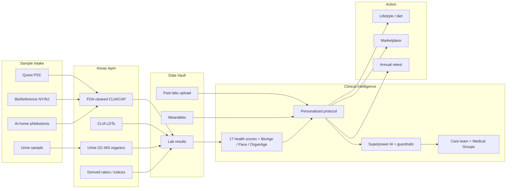

# Biomedical engineering map

**Compiled:** 2026-09-09 (Australia/Sydney)  
**Owner lens:** biomarker panel + clinical intelligence layer + related bioeng stack  
**Evidence standard:** Official-site preferred. Conflicts / litigation / secondary labelled.



---

## 1. Company snapshot (bioeng-relevant)

| Field | Detail | Label |
| --- | --- | --- |
| Entity | Superpower Health, Inc. | Official |
| Product | Cash-pay membership: labs → dashboard → AI + care → marketplace | Official |
| Legal posture | Tech facilitator; clinical care via affiliated Medical Groups | Terms |
| Founders | Max Marchione (CEO), Jacob Peters, Kevin Unkrich (CTO) | Press / site |
| Clinical lead | Dr Anant Vinjamoori, MD — Chief Longevity Officer | Official |
| Current consumer price | **$349/yr** (checkout NY/NJ often **$599**; some pages **$399** / 90+ markers) | Conflict |
| Panel claim | **150+ biomarkers across 2 blood draws** | Homepage / FAQ |
| Scale (marketing) | 64,000+ members; 6M+ biomarkers analyzed | Marketing |

See also: [overview.md](overview.md), [product-pricing.md](product-pricing.md).

---

## 2. Biomarker panel

### Sample path

| Modality | Role | Notes |
| --- | --- | --- |
| Venous blood | Core | ~10–15 min; Quest “2,000+” PSCs (older copy “3,000+”) |
| BioReference | NY/NJ draw network | Location / checkout SKUs |
| At-home phlebotomy | Optional | Typically **+$119** |
| Urine | On baseline panel product | Organic acids / UA elements |
| Wearables | Context only | Apple Health, Whoop, Oura — **not** lab biomarkers |

**Prep:** ~8–10h food/caffeine fast; hold biotin-containing supplements.  
**Turnaround:** ~5–10 days / “about a week.”

### Frequency & count framing

- **Current FAQ consensus:** baseline panel + **~60+ biomarker retest** later = **150+ combined** for the year.
- Company states reports are a **mix of direct and derived** metrics ([best-biomarkers](https://superpower.com/best-biomarkers)).
- **Conflicts:** older pages still say **100+** / one annual draw; blog **$199**.

### Lab partners

| Partner | Role | Source |
| --- | --- | --- |
| Quest Diagnostics | Primary consumer network | Site / FAQ |
| LabCorp | May perform testing | Membership Agreement |
| BioReference | NY/NJ | Location / checkout |
| GRAIL (Galleri) | MCED add-on (Rx path) | Site + PR (Apr 2026) |

### Assay classes (from `/biomarkers` method notes)

1. **FDA-cleared** clinical assays in **CLIA-certified, CAP-accredited** labs  
2. **CLIA LDTs** (explicitly not FDA-cleared) — e.g. many sex steroids, IGF-1, MMA, ADMA/SDMA, adiponectin  
3. **Derived ratios/indices** — not FDA-cleared as tests (AIP, TyG, NLR/SII, Castelli, Non-HDL/ApoB, …)  
4. **Urine organic acids** via **GC-MS** (CLIA `17D0919496` cited on marker pages)  
5. **Neuro / genetic** markers listed on Baseline catalog (Aβ40/42, pTau-217, APOE) — confirm state + membership inclusion vs add-on

### Category map (partial published counts)

Homepage FAQ buckets (marketing): Hormones & thyroid **19** · Cancer/risks **10** · Heart & metabolic **41** · Aging **3** · Energy **6** · DNA health **7**.

`best-biomarkers`-style system counts (partial): Heart/vascular **17** · Liver **13** · Kidney **9** · Sex hormones **8** · Nutrients-related **19** · Thyroid **4**.

**Highlighted “deeper than physical” markers (confirmed named):** ApoB, sex-steroid core + thyroid, hs-CRP, Vitamin D, full iron panel; pathways also name Lp(a), magnesium, fasting glucose/insulin.

**Catalog taxonomy** (encyclopedia at `/biomarkers`): brain, DNA/methylation, energy, gut, heart & vascular, immune (IgE + autoimmune Abs), inflammation, kidney, liver, metabolic, hormones/thyroid, nutrients, aging scores.

### Add-ons (marketplace)

Gut microbiome · toxins / heavy metals / PFAS · Galleri · autoimmune & inflammation · celiac · ADMA/SDMA (blood vessel) · Advanced Blood Panel (checkout Quest ~$388 / BioRef ~$598) · custom panels.

### Counting dispute **[litigation / allegations]**

*Function Health, Inc. v. Superpower Health Inc.*, C.D. Cal. **2:26-cv-00810** (filed Jan 2026; parties later represented settlement; dismissed without prejudice Jun 2026 per profile legal notes). Complaint alleged ~**55 direct** measurements + many ratios marketed as biomarkers, and challenged location / “24/7 clinical” framing. Treat as **allegations**; use company “direct + derived” disclosure when quoting “150+.”

### Open panel gaps

- Authoritative full inventory (all direct assays vs calculated) not published as one primary downloadable list.  
- Exact first-draw vs second-draw assay split only partially disclosed.  
- Which Baseline neuro markers ship in $349 membership vs add-on / state SKUs.

---

## 3. Clinical intelligence layer

### Pipeline

1. Baseline labs (+ urine) → Data Vault  
2. Dashboard: plain-language markers, longitudinal trends, multi-system scores  
3. Personalized protocol (lifestyle, diet, supplements, retest timing)  
4. Superpower AI chat (member-context grounded)  
5. Care team escalation; clinical/Rx via affiliated Medical Groups  
6. Retest → protocol update  

**Inputs:** Superpower labs · uploaded past labs · wearables · goals/preferences · symptoms/history.

### Scoring products

| Product | Claim | Notes |
| --- | --- | --- |
| ~17 health scores | System-level dashboard | Marketing |
| Health Score / BioAge / Pace of Aging | Aging trio on homepage | Aging category count = 3 |
| BioAge method | **Modified PhenoAge** from blood biomarkers vs “optimal” ranges | Marketing / Fierce framing |
| **OrganAge** (May 2026) | **9 organ ages** from **one blood draw** | Furman (Buck / Stanford); DiseaseAge / UK Biobank n≈456k; mortality-trained; HRS validation claimed |

OrganAge systems: heart, brain, liver, kidneys, lungs, immune, metabolism, musculoskeletal, nervous.

### Superpower AI (official blogs)

- Marketed as proprietary health LLM (not generic chatbot)  
- Capabilities claimed: retrieve context, evaluate scientific claims, structured clinical logic, escalate to human review, personalize protocols  
- **Human-in-the-loop:** clinicians review/score models weekly  
- Grounding: labs + uploads + wearables + current protocol + internal medical frameworks  
- Privacy Policy: no legal/significant AI decisions without human review  
- Environment framed HIPAA-aligned; export/delete; never sold (marketing vs covered-entity hedge on Privacy Policy)

### Clinical model & research

- Blends **functional + lifestyle + longevity + preventive** medicine ([clinical model blog](https://superpower.com/blog/superpowers-clinical-model))  
- Research Team: evidence hierarchy → link to biomarkers/interventions → feed clinical model + AI; “Reviewed by Superpower Research Team” badge  
- Scope-aware; refers out for specialty care outside offering  

### Care / Rx engineering

| Layer | Detail |
| --- | --- |
| Order & result sign-off | Physicians / qualified providers sign off on **lab orders and results**; critical results escalate |
| Provider types | Licensed physicians, NPs, pharmacists (FAQ) |
| Non-clinical care team | CS, RDNs, coaches / advisors (Terms) |
| Response SLA | FAQ: **≤1 business day** weekdays — **tension** with “24/7” marketing |
| Pharmacies | Strive, Belmar, Progress (FAQ); LegitScript certified |
| EHR write-back | **Not confirmed** (members can share with outside PCP) |

---

## 4. Broader bioeng / platform notes

```
[Member app / web — app.superpower.com; App Store id 6747997159]
  ├─ Intake (history, goals, meds/supplements)
  ├─ Lab ordering (licensed clinician sign-off)
  ├─ Scheduling → Quest | BioReference (NY/NJ) | at-home phlebotomy
  ├─ Results ingest → dashboard / scores / BioAge / OrganAge / protocol
  ├─ Superpower AI (guardrailed Q&A)
  ├─ Care team messaging
  ├─ Wearable sync + past lab upload
  └─ Marketplace → add-on labs | supplements | compounded Rx
```

| Topic | Status |
| --- | --- |
| Privacy / security | Marketing HIPAA + SOC 2 **alignment**; TLS; AES-256 claims on privacy blog — Privacy Policy hedges covered-entity status |
| Public developer API / model card | **Not found** |
| Named LLM / ML ops vendors | **Not disclosed** |
| Site stack signals | Webflow + Intellimize; analytics tags (Meta, GA, TikTok, Klaviyo-style) |
| HSA/FSA | Eligible; checkout `FLEX` / HSA_FSA rails; no insurance billing |
| Compounded products | Disclosed not FDA-approved |

---

## 5. Source URLs (primary)

- https://superpower.com/  
- https://superpower.com/how-it-works · /blood-test · /biomarkers · /faqs · /best-biomarkers  
- https://superpower.com/marketplace/products/baseline-panel  
- https://superpower.com/biological-age · /introducing-organage · /galleri · /healthintelligence  
- https://superpower.com/blog/superpowers-clinical-model  
- https://superpower.com/blog/superpower-ai-a-new-kind-of-health-intelligence  
- https://superpower.com/blog/inside-the-superpower-research-team  
- https://superpower.com/blog/your-data-protected-and-in-your-control  
- https://superpower.com/legal/terms · /legal/membership · /legal/privacy  

Related profile files: [product-pricing.md](product-pricing.md), [labs-geography.md](labs-geography.md), [legal-compliance.md](legal-compliance.md), [../sources/website-brief.md](../sources/website-brief.md).
