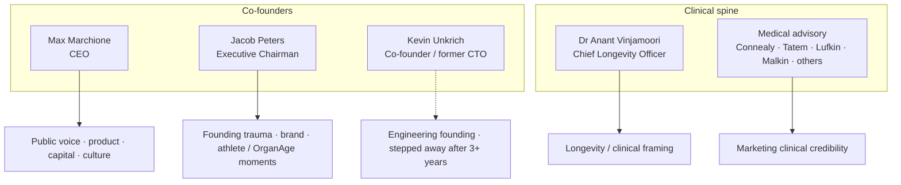

# Founders & core team

### Superpower Health — people narrative

**As of:** 9 September 2026  
**Companion to:** [narrative.md](narrative.md) (company arc) · [leadership.md](leadership.md) (roster tables)  
**Evidence rule:** Official site and first-party pages preferred. X bios and press labelled. Titles that conflict across databases are resolved toward the Series A / careers pages unless noted. Not a claim of current employment for every named advisor.

---

## How the founding trio fits together

Superpower’s public story is not a single founder myth. It is three overlapping failures of the existing system—catastrophic near-death, chronic misdiagnosis, and a friend’s late imaging—that the company uses as proof that reactive care is structural, not anecdotal.

On the official Series A page, **Max Marchione** signs as **CEO** and **Jacob Peters** as **Executive Chairman**. **Kevin Unkrich** appears in origin lore often as “Kevin” only; his full name and co-founder/CTO status are clearer on X and in press than on primary marketing pages. Treat Kevin’s **current operating role as unconfirmed** on the live site—his own pinned post states he stepped away after more than three years as co-founder/CTO.

---

## Max Marchione — CEO, co-founder

**Public posture.** Max is the company’s most visible operator-narrator: Series A authorial voice, careers page in the first person (“Max, the founder”), roadmap essays, a personal newsletter ([maxsmusings.com](https://maxsmusings.com)), and the X handle [@maxmarchione](https://x.com/maxmarchione) (“Building a new health system. Founder @superpower”). He publishes contact points that read as open doors—**max@superpower.com** (and **m.marchione@superpower.com** on first-party pages)—with the claim that he reads every email.

**Founding wound (official Series A).** For about ten years he was misdiagnosed, saw more than a dozen doctors, and was told to medicate for life. That arc becomes the consumer thesis: measurement and context should arrive before lifelong prescriptions and fragmented portals.

**Background (press / profiles).** Public profiles describe an Australian path—Sydney University commerce/law dropout narrative, investment-banking experience (Goldman Sachs cited in third-party write-ups), then the Superpower build in San Francisco. Whether every biographical colour is repeated on the company site varies; the durable official facts are CEO title, Series A authorship, and the misdiagnosis story.

**On X (snapshot Sep 2026).** ~34K followers; pinned April 2025 post on the **$30M Series A** (Forerunner, Day One, and a roll-call of operators and celebrities). Recent amplification of member praise (“best medical experience”) fits a CEO who treats social proof as distribution.

**What he represents in the company story.** Speed, taste, A+ hiring, anti-credential bias on careers copy, visa sponsorship as a real lever, and the long bet that AI plus labs can become the front door to healthcare. When Superpower speaks in manifesto language, it usually sounds like Max.

---

## Jacob Peters — Executive Chairman, co-founder

**Public posture.** Jacob’s X bio ([@J__Cub](https://x.com/J__Cub)) frames him as working to make the world healthier: founder @superpower, **3× startup founder**, investor in **100+** companies via Launch House Ventures; LA & SF; personal site [jacobpeters.com](https://jacobpeters.com). Company Series A titles him **Executive Chairman**. Some third-party databases still label him CEO—prefer the official Series A designation.

**Founding wound (official Series A).** He was at the brink of death: **four months in ICU**, loss of **three major organs**, and a hospital bill on the order of **$2 million**, after years of missed diagnoses. That story is the sharpest brand asset in the pack: the system did not merely inconvenience him; it nearly ended him and then billed him for it.

**Public moments (X-adjacent, 2025).** Visible in company narrative moments around **OrganAge** launch commentary and the **Giannis Antetokounmpo** athlete/investor alignment; also associated with messaging that HQ remains San Francisco. Exact product ownership is less documented on the marketing site than Max’s CEO lane—Jacob reads as founding legitimacy, capital/network gravity, and the embodied patient story.

**What he represents.** The cost of reactive care made personal. Where Max’s story is chronic friction, Jacob’s is acute catastrophe. Together they argue that Superpower is not a wellness toy—it is a response to a system that fails both slowly and suddenly.

---

## Kevin Unkrich — co-founder, former CTO

**Public posture.** [@KevinUnkrich](https://x.com/KevinUnkrich): “(bio)hacker, minimalist | prev founded @superpower; @ycombinator s20 alum; aws engineer; 30u30”; based in San Francisco. Official blog origin copy often says only **“Kevin.”** Full name and engineering co-founder identity are stronger off the primary homepage than on it.

**Founding wound (press / founding lore).** A friend’s death from a brain tumour **days before a scheduled MRI**—the imaging that might have changed the outcome arriving too late. That story is the product’s quiet thesis statement: latency kills; earlier signal matters.

**Status note (his own X, pinned ~13 Mar).** He states he **stepped away after 3+ years as co-founder/CTO**. For diligence and narrative honesty, Kevin remains a **founding engineer** in the origin story; he should **not** be described as the sitting CTO unless a current official page reconfirms it.

**Background colour.** YC S20 alum, prior AWS engineering, Forbes 30 Under 30 citations in public bios—useful context for the technical founding of a lab-and-app platform, not a claim about day-to-day ownership in 2026.

---

## Dr Anant Vinjamoori, MD — Chief Longevity Officer

**Official role.** Named on the manifesto and Series A surfaces as **Chief Longevity Officer**—the senior clinical brand seat beside the founders.

**Background (off-site / press).** Harvard MD/MBA; prior work associated with **Virta** and **Modern Age** in public profiles. He is the bridge between consumer membership marketing and longevity-medicine vocabulary: biological age, protocols, and the claim that comprehensive biomarkers are not “extra labs” but a different standard of baseline.

**Narrative function.** Founders supply the why; Anant supplies clinical legitimacy for the what. When Superpower talks about longevity rather than only prevention, this is the titled voice on the org chart.

---

## Medical advisory & featured clinicians

The site repeatedly features a rotating set of named physicians as advisors or marketing clinicians. They are **credibility infrastructure**, not presented as day-to-day employees on the Series A letterhead.

| Name | Typical placement |
| --- | --- |
| Dr Leigh Erin Connealy, MD | Homepage / manifesto |
| Dr Alex J. Tatem, MD | Homepage / manifesto |
| Dr Robert Lufkin, MD | Homepage / manifesto / Series A advisor orbit |
| Dr Abe Malkin, MD | Homepage / manifesto |
| Dr Amy Shah, M.D. | Blood-test / baseline landings |
| Dr Molly Maloof, MD | Base acquisition landing |
| Dr Derick En’Wezoh, MD | Base landing |

Treat this list as **marketing-visible**, verify before outreach, and do not collapse “featured on site” into “executive team.”

---

## Operating leaders seen in public (soft)

Names that have appeared in LinkedIn / public company context—**may change; not official-site canonical**:

- Claire Tolson — Head of Clinical Operations  
- Shaun Miller — VP Medical Operations  
- Sofía Prendoné Pita — Clinical Operations  
- Manoj Arachige — Head of Product  
- Tim Denman — VP Enterprise (reported in some contexts)

Careers copy also claims a team dense with former founders, YC alumni, a Thiel Fellow, and operators from places like Goldman, Amazon, and Harvard Medical School. That is self-description for recruiting, not an org chart.

---

## Design & brand (early non-biomed)

**Hannah Ahn** — Founding Designer (Jul 2024) → Head of Design; founder-class vanity `/hannah`; prior Next Chapter with Max. High confidence early core; not a day-0 legal co-founder.  
**Tracy Chen** — Daybreak product design for Superpower ~2 years before Aug 2026 hire; continuity, not founding.  
**Jason Combs & Aimee Lee** — 2026 brand/creative hires.  
**Annie Whelan** — enterprise/sales; out of design-org narrative.  

Digs: [`sources/special-topics/early-team/`](../sources/special-topics/early-team/).

> **X footnote (Hannah):** design squad named on X — [`@nilseller`](https://x.com/nilseller) [`@flornkm`](https://x.com/flornkm) [`@jarviswang__`](https://x.com/jarviswang__) (hire post [`1999236065417425277`](https://x.com/hannah_ahn/status/1999236065417425277)). Not early-core, just adjacent bench.

---

## Culture as a people product

Official careers language describes flat “founder mode,” radical empowerment, Day One mentality, preference for raw ability over résumé, and **visa sponsorship**. Engineering, product, design, ops, legal, and clinical skew **in-person San Francisco**; brand, creative, and marketing can be remote. The people narrative and the product narrative rhyme: agency, speed, measurement, and impatience with gatekeepers.

---

## Reading the cast

| Person | Official / best title | Core story | Current confidence |
| --- | --- | --- | --- |
| Max Marchione | CEO, co-founder | Decade of misdiagnosis | High — live company pages + X |
| Jacob Peters | Executive Chairman, co-founder | ICU / organ loss / $2M bill | High — Series A; some DBs still say CEO |
| Kevin Unkrich | Co-founder; former CTO | Friend’s late MRI | High as founder; **low as current operator** |
| Dr Anant Vinjamoori | Chief Longevity Officer | Longevity / clinical framing | High for title; bio details partly off-site |
| Named MDs on site | Advisors / featured | Specialty credibility | Marketing-visible; verify live |
| Hannah Ahn | Founding Designer → Head of Design | Early design & brand core | High as early core; **not** day-0 legal co-founder |
| Ops / product names | Soft LinkedIn context | Execution layer | Verify before citing |

Together they sell one sentence: **the people who built Superpower were failed by reactive care, then hired clinical and product talent to productise earlier signal.** For the full company arc—pricing, capital, competition, litigation—see [narrative.md](narrative.md).

---

### Assets

- [../assets/max-marchione.png](../assets/max-marchione.png) — @maxmarchione  
- [../assets/jacob-peters.png](../assets/jacob-peters.png) — @J__Cub  
- [../assets/kevin-unkrich.png](../assets/kevin-unkrich.png) — @KevinUnkrich  
- [../assets/company-superpower.png](../assets/company-superpower.png) — @superpower  

### Primary sources

1. https://superpower.com/series-a — founding wounds, Max CEO / Jacob Executive Chairman  
2. https://superpower.com/careers — culture, Max voice  
3. https://superpower.com/manifesto — Anant + advisory orbit  
4. https://superpower.com/blog/superpower-is-now-199 — “Kevin” in origin copy (**retired** 2026-09-11, 301→`/blog`)  
5. Public X profiles — @maxmarchione, @J__Cub, @KevinUnkrich (status pin)  
6. Press / Sacra / TechCrunch — background colour; labelled off-site where used  

---

*End of founders & core team narrative — synthesised 9 September 2026.*
