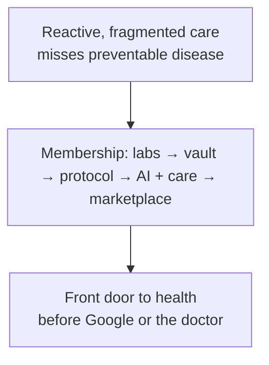
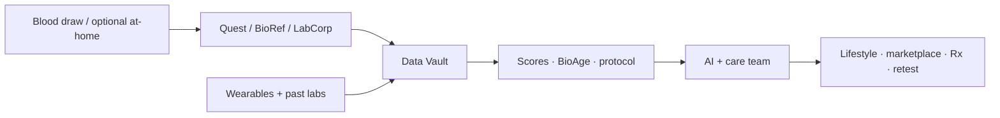

# Superpower Health

### A company narrative

**As of:** 9 September 2026  
**Subject:** Superpower Health, Inc.  
**Purpose:** Publication-grade synthesis of public materials into one coherent account  
**Evidence rule:** Official site and first-party pages preferred. Conflicts retained and labelled. Not legal, medical, or investment advice.

---

## The problem they claim to solve

American healthcare, in Superpower’s telling, fails three tests at once. It reacts late. It fragments the patient across portals and specialties. And it leaves a long gap—often cited as roughly seventeen years—between what research knows and what clinic practice delivers. Chronic and preventable disease keep rising; the company repeats a familiar public-health framing that roughly four in ten Americans face conditions that earlier information could have changed.

Superpower’s answer is not another clinic chain. It is a **cash-pay membership platform**—marketed as a “health super app”—that tries to put lab-grade measurement, a unified data layer, AI guidance, and a care team in one consumer product, priced like a gym membership rather than concierge medicine.

The legal posture is careful: Superpower Health, Inc. presents itself as a **technology company that facilitates** access to third-party labs, clinicians, and pharmacies. Clinical care runs through affiliated medical groups. The company is not itself a licensed healthcare provider in the sense consumers often assume when they join a “health” brand.

---

## Origin

The founding story is personal, and the company treats it as brand infrastructure rather than soft colour.

**Jacob Peters**—Executive Chairman on the Series A page—nearly died: months in intensive care, multiple organs lost, a hospital bill in the millions, and years of missed diagnoses beforehand. **Max Marchione**—CEO on the same official pages—spent a decade cycling through doctors, misdiagnosis, and the promise of lifelong medication. A third co-founder, **Kevin Unkrich** (engineering background in public profiles; often associated with the CTO seat), is tied in founding lore to a friend’s death from a brain tumour days before a scheduled MRI.

Together they argue that reactive care is not an edge case. The product thesis that follows is blunt: give people comprehensive biomarkers early, keep the data in one place, translate it into a protocol, and keep a human-plus-AI loop available so insight turns into action.

---

## What the company is

| | |
| --- | --- |
| **Legal name** | Superpower Health, Inc. |
| **Brand** | Superpower |
| **Founded** | 2023 (press / company reporting) |
| **Web** | [superpower.com](https://superpower.com) |
| **App surface** | [app.superpower.com](https://app.superpower.com/) |
| **Addresses** | Legal/privacy: 11209 National Blvd, Unit #1016, Los Angeles, CA 90064 · Careers office: 140 New Montgomery St, San Francisco |
| **Leadership (official titles)** | Max Marchione, CEO · Jacob Peters, Executive Chairman · Dr Anant Vinjamoori, MD, Chief Longevity Officer |

Public headcount estimates vary widely (roughly the high tens to low hundreds). Treat them as soft. Culture language on careers emphasises “founder mode,” merit over pedigree, visa sponsorship, and in-person concentration in San Francisco for engineering, product, design, ops, legal, and clinical—with brand and marketing more flexible on location.

---

## The product, in one arc

Members buy an **annual membership**. The current consumer homepage and checkout catalog (September 2026) centre on roughly **$349 per year** for a baseline membership framed as **150+ biomarkers across two blood draws**, a results dashboard (“Data Vault”), a personalised protocol, Superpower AI chat, and access to an on-demand care team plus a marketplace for add-on diagnostics, supplements, and prescription pathways.

Geography is US-only. Marketing cites coverage across most states (often “37+”), with **New York and New Jersey** called out for different testing and fees—checkout shows a separate baseline SKU near **$599/year**. Draws typically happen at **Quest Diagnostics** patient service centres (marketing says 2,000+ locations; older copy sometimes says 3,000+). LabCorp appears in the Membership Agreement as a lab that may perform testing; BioReference appears in NY/NJ checkout variants. At-home phlebotomy is available at extra cost.

Insurance is not billed. Membership is not health insurance. **HSA/FSA eligibility** is heavily marketed. Results are generally promised in about a week.

Under the hood, the biomedical stack is a pipeline: sample intake → CLIA/CAP (and some LDT) assays plus derived indices → vault (labs, uploads, wearables) → clinical intelligence (health scores, biological age, protocol, AI with guardrails, care team) → lifestyle, marketplace, and retest. The company is explicit in places that reports mix **direct measurements and derived metrics**—a distinction that later became legally contested.

Add-ons extend the core: gut and toxin panels, GRAIL Galleri multi-cancer screening, advanced blood panels, peptides and compounded hormones where clinically appropriate (with the usual compounded-product disclosures), and B2B / employer channels (including a Thatch partnership reported by Sacra).

---

## Pricing that moved with the market

No single price story survives 2025–2026 without footnotes. That is part of the company narrative, not a footnote to ignore.

| Moment / surface | Figure that appeared | Framing |
| --- | --- | --- |
| Launch coverage (Apr 2025) | ~$499/yr | Biannual labs, 100+ biomarkers |
| Mid-period / blog & some FAQs | ~$199/yr | Historical price cut; `$199` blog **retired** 2026-09-11 (301→`/blog`) |
| Homepage + checkout (Sep 2026) | **$349/yr** baseline; **$599/yr** NY/NJ | 150+ markers across two draws |
| Legacy Base acquisition landing | $399 / $499 options | Older packaging still live in places |
| Employer channel (Sacra) | ~$179/yr via Thatch | B2B benefits |

Biomarker counts and draw frequency drift in parallel: “100+” vs “150+ across two draws,” one annual panel vs baseline plus mid-year retest. Publication practice for this company is to **quote the live homepage and checkout**, then note older pages as historical packaging.

---

## Capital and ambition

In April 2025 the company announced a **$30 million Series A** led by **Forerunner Ventures**, with Susa, Long Journey, Day One, Family Fund, Bond, Opal, Valia, Visible, Winklevoss Capital, and a roster of operator and celebrity angels (DoorDash and Sweetgreen founders among operators; Hudgens, Aoki, Logan Paul, Giannis Antetokounmpo among public names). A **$4 million** pre-seed (May 2024, Susa-led) sits underneath. Working diligence total across those two disclosed rounds is about **$34 million**. Later Australian press has used higher raise and valuation language (including a ~$432M figure); those should be treated as secondary until reconciled with primary filings or company confirmation. Launch-era coverage often put post-money above **$300 million**.

The Series A letter sketches three pillars for the next phase: **full medical context** (labs plus EHR, wearables, genomics, imaging, habits), a living **medical knowledge** layer distilled through AI, and **real-world action** endpoints—diagnostics, therapeutics, supplements, clinicians—so plans become behaviour. The stated end state is radical: the algorithm as the front door to healthcare, before Google or the doctor. Careers copy goes further still—owning labs, clinics, wellness centres, pharmacies, running research, and “stealth” projects—while the live product today remains a membership over third-party infrastructure.

Traction signals are public but not audited: waitlist language around **~150,000** at launch; marketing badges citing **64,000+ members** on some pages; self-reported rapid revenue growth in 2026 press; acquisitions of **Feminade** (women’s hormones / fertility, early 2025) and **Base** (nutrition-focused testing, mid-2025). Quest is the visible lab partner; SoulCycle has appeared in partnership press. Ashby careers boards in September 2026 still show a broad hiring slate—engineering, design, clinical NPs, GTM, compliance, Chief of Staff—consistent with a company still scaling hard.

---

## Competitive field

Superpower sits in the crowded preventive / longevity membership tier. **Function Health** is the clearest direct rival—larger capital base in later 2025 press, overlapping membership framing, and the plaintiff in the company’s most material public legal fight. Adjacent players include InsideTracker, Lifeforce, Marek Health, Fountain Life, Forward, and a long tail of metabolic and at-home testing brands. Superpower publishes its own comparison pages; price cuts from the $499 launch band toward the low–mid hundreds look like a deliberate move from biohacker niche toward mass HSA/FSA wellness spend.

---

## Risk, honestly told

In January 2026, **Function Health, Inc. v. Superpower Health Inc.** (C.D. Cal., 2:26-cv-00810) alleged false advertising and unfair competition under the Lanham Act—central themes included overstated “100+ lab tests/biomarkers” relative to directly measured analytes versus ratios and indices, and comparative advertising. Docket summaries indicate the parties represented a **settlement**; the case was dismissed without prejudice in June 2026, with a path to prejudice thereafter. Settlement terms were not public in sources reviewed. Marketing language after that date should be read with that history in mind.

Structural sector risks remain: FDA and state-board constraints on DTC labs and AI recommendations; margin pressure as rivals compete on price; limited clinical-trial validation of AI protocols by traditional standards; and regulatory sensitivity around compounded peptides and hormones. Privacy marketing says “HIPAA-compliant” storage; the Privacy Policy is more nuanced about whether Superpower itself is a covered entity versus affiliated providers.

---

## How to read Superpower

Stripped of launch rhetoric, Superpower Health is a **Delaware-incorporated, Los Angeles–legal / San Francisco–operating consumer health membership company** that sells annual access to broad biomarker testing, a unified dashboard, AI-assisted interpretation, and a marketplace—financed by venture capital, partnered to Quest-scale lab networks, and positioned against both traditional primary care friction and premium longevity clinics.

Its coherence as a business story hangs on three bets:

1. **Measurement at consumer price** can become habitual (two draws a year, not a one-off biohack).  
2. **Context plus protocol**—not raw PDF labs—is the product people renew for.  
3. **AI as front door** can eventually own the relationship that today belongs to Google search and episodic doctors’ visits.

Whether those bets hold is outside this narrative. What the public record supports is a young company (founded 2023), loudly funded in 2025, still rewriting its price and panel packaging through 2026, litigiously tested by its closest competitor, and still hiring as if the platform chapter is unfinished.

---

## Source hierarchy

1. Official site: homepage, how-it-works, FAQs, checkout catalog, legal (privacy / terms / membership), manifesto, Series A, careers  
2. First-party Series A announcement (Forerunner-led $30M narrative)  
3. High-signal press and research (TechCrunch launch, Fierce, Sacra, Forbes Australia)  
4. Docket summaries for Function Health litigation  
5. Secondary directories for headcount / revenue — soft only  

Founder and core-team narratives live in [founders-and-team.md](founders-and-team.md). Detailed tables, discrepancy logs, inbound link trees, X profiles, and biomedical stack maps live alongside this narrative in the company profile pack (`company/`, `sources/`, `assets/`).

---

*End of narrative — Superpower Health, Inc. — synthesised 9 September 2026 from public sources consolidated across the Superpower agent set.*
