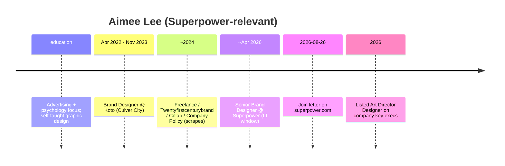

# Aimee Lee — Early team pack (inbound + outbound)

**Subject:** Design — brand / **Art Director** (Senior Brand Designer) at Superpower — **2026 hire**, not founding core  
**Prepared:** 2026-09-09 (AEST)  
**Method:** WebSearch + WebFetch + curl of public pages. Prefer primary sources.  
**Status:** Consolidated diligence draft — no invention; gaps labeled.  
**Scope:** Official-site inbound + outbound (LinkedIn, portfolio).

---

## TLDR

| Claim | Verdict | Confidence |
|---|---|---|
| Full name **Aimee Lee**; Design @ Superpower | **Supported** (careers + join blog + LI `aimeejinlee`) | **High** |
| Art Director / Senior Brand Designer / brand storytelling | **Supported** — LI company key execs list **“Art Director Designer”**; LI role Senior Brand Designer; AeroLeads “Art Director + Designer” | **High** |
| Join ~**Apr 2026** (Senior Brand Designer window in scrapes); blog **Aug 26, 2026** | **Supported** with date fuzz — LI showed Apr–Jun 2026 Senior Brand Designer (2 mo) then current Design | **Medium–High** |
| LA metro; brand remote-eligible | **Supported** | **High** |
| Non-biomed | **Strong** — psychology/advertising → graphic/brand; Koto, Company Policy, agencies | **High** |
| Early founding-core | **Not day-0**; 2026 brand IC; may have done Superpower campaign work pre-hire (portfolio) | **Medium** for campaign continuity; **Low** for founding employee |
| Founder-class vanity `/aimee` | **404** — no short vanity | **High** |

**Identity disambiguation:** **Not** Aimee Lee the Ohio/Midwest hanji papermaker (`aimeelee.net`, Fulbright). Target designer: **aimeejinlee** / portfolio **aitsmee.com**.

---

## On-site (inbound)

**Lane:** Official-site inbound (checked **2026-09-09**).

| Signal | URL | Result |
|---|---|---|
| Vanity short path | https://superpower.com/aimee | **404** — no founder-class vanity |
| Join blog (author letter) | https://superpower.com/blog/why-i-joined-superpower-aimee-lee | **200** — **Written by Aimee Lee · August 26, 2026** |
| Author / Meet page | https://superpower.com/author/aimee-lee | **200** — “Meet Aimee Lee, Design” |
| Careers — Meet the team | https://superpower.com/careers | **Yes** — Design + join slug |

**On-site takeaway:** Careers + join letter + author page confirm Design / brand lane. **No** vanity path. Brand/art-director IC — **2026 hire**, not founding core.

---

## Role snapshot

| Field | Public claim | Source class |
|---|---|---|
| Careers card | **Aimee Lee — Design** | careers Meet the team |
| LinkedIn company key execs | **Aimee Lee: Art Director Designer** | LinkedIn company Superpower |
| LinkedIn profile | Design @ Superpower; prior **Senior Brand Designer** @ Superpower; **Senior Brand Designer** @ Company Policy; **Brand Designer** @ Koto (Apr 2022 – Nov 2023) | LinkedIn / AeroLeads |
| Location | Los Angeles Metropolitan Area | Aggregators + LI patterns |
| Education (aggregator) | B.S. Advertising and Art Direction, Boston University | AeroLeads — treat as secondary |
| Portfolio | https://aitsmee.com/ — includes **“Superpower Campaign, Social Identity, Art Direction”** | Personal site |

---

## Off-site (outbound)

| Source | URL | Claims |
|---|---|---|
| LinkedIn | https://www.linkedin.com/in/aimeejinlee | Brand Design & Art Direction; Superpower Design |
| Portfolio | https://aitsmee.com/ | Superpower Campaign + Koto / Company Policy work |
| AeroLeads mirror | https://aeroleads.com/in/aimeejinlee | Art Director + Designer @ Superpower; LA; prior Koto email signal |
| Company LI key execs | https://linkedin.com/company/superpower | Listed among key executives as Art Director Designer |

---

## Career timeline (public)

---

## Non-biomed + early-core

| Signal | Evidence | Biomed? |
|---|---|---|
| Brand / art direction agencies | Koto, Company Policy, portfolio | No |
| Psychology / advertising study | Join letter | No |
| Superpower remit | Brand rebuild / identity | Design — **not** clinical |

**Early-core flag:** **Not founding-era employee.** High-confidence **non-biomed brand/design IC**. Portfolio Superpower campaign may predate employment (agency) — **do not invent** employment start from campaign alone. Notable: appears on LinkedIn **key executives** list (unusual for pure IC — title elevation to Art Director).

---

## Key URLs

1. https://superpower.com/blog/why-i-joined-superpower-aimee-lee  
2. https://superpower.com/author/aimee-lee  
3. https://superpower.com/careers  
4. https://www.linkedin.com/in/aimeejinlee  
5. https://aitsmee.com/  
6. https://linkedin.com/company/superpower  

---

*Compiled for due diligence. Do not treat as employment verification.*  
*Merged from outbound pack + on-site inbound (vanity/blog/author).*
