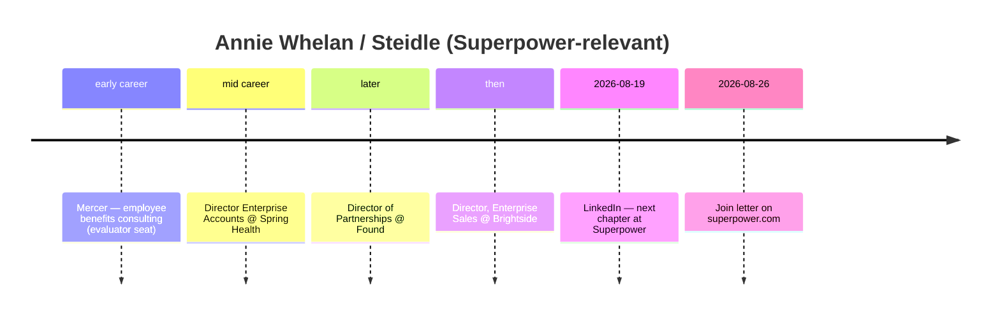

# Annie Whelan — Early team pack (inbound + outbound)

**Subject:** Sales / Enterprise (B2B) at Superpower — **Aug 2026 hire**, not founding core  
**LI display name:** **Annie (Whelan) Steidle**  
**Prepared:** 2026-09-09 (AEST)  
**Method:** WebSearch + WebFetch + curl of public pages. Prefer primary sources.  
**Status:** Consolidated diligence draft — no invention; gaps labeled.  
**Scope:** Official-site inbound + outbound (LinkedIn).

---

## TLDR

| Claim | Verdict | Confidence |
|---|---|---|
| Public / blog name **Annie Whelan**; LI **Annie (Whelan) Steidle** | **Supported** — same person (join announce + prior Brightside posts) | **High** |
| Sales / Enterprise (B2B) @ Superpower | **Supported** — careers **Sales**; LI **Enterprise**; join announce enterprise chapter | **High** |
| Joined **Aug 2026** | **Supported** — LI post **2026-08-19**; blog Aug 26 / updated Aug 28–29 | **High** |
| Prior: Mercer → Spring Health, Found, Brightside (enterprise/partnerships) | **Supported** (blog + LI) | **High** |
| Lives Venice Beach / LA | **Supported** (blog; LI Los Angeles) | **High** |
| Non-biomed | **Strong** — benefits consulting / health-tech *sales & partnerships* (vendor side), not clinician | **High** |
| Early founding-core | **No** — Aug 2026 enterprise hire | **High** |
| Founder-class vanity `/annie` | **404** — no short vanity | **High** |

**Identity disambiguation:** Married name **Steidle** on LinkedIn; careers/blog still **Annie Whelan**. Not other enterprise “Annie” sales leaders (Salesforce Annie Nguyen, etc.).

---

## On-site (inbound)

**Lane:** Official-site inbound (checked **2026-09-09**).

| Signal | URL | Result |
|---|---|---|
| Vanity short path | https://superpower.com/annie | **404** — no founder-class vanity |
| Join blog (author letter) | https://superpower.com/blog/why-i-joined-superpower-annie-whelan | **200** — **Written by Annie Whelan · August 26, 2026** |
| Author / Meet page | https://superpower.com/author/annie-whelan | **200** — “Meet Annie Whelan, Sales” |
| Careers — Meet the team | https://superpower.com/careers | **Yes** — **Sales** + join slug |

**On-site takeaway:** Careers + join letter + author page confirm Sales/Enterprise. **No** vanity path. **2026 GTM hire**, not founding non-biomed core.

---

## Role snapshot

| Field | Public claim | Source class |
|---|---|---|
| Careers card | **Annie Whelan — Sales** | careers Meet the team |
| LinkedIn | **Enterprise** @ Superpower (current); display **Annie (Whelan) Steidle** | LinkedIn |
| Prior titles | Director, Enterprise Sales @ **Brightside**; Director of Partnerships @ **Found**; Director, Enterprise Accounts @ **Spring Health**; earlier **Mercer** benefits consulting | LI + join blog |
| Location | Venice Beach with husband + two dogs; LI Los Angeles | Blog; LinkedIn |
| Background color | Competitive platform/springboard diver (college) | Join blog |

---

## Off-site (outbound)

| Source | URL | Claims |
|---|---|---|
| LinkedIn | https://www.linkedin.com/in/annie-whelan-steidle-756351121 | Enterprise @ Superpower; Brightside / Found / Spring Health |
| Join announce | https://www.linkedin.com/posts/annie-whelan-steidle-756351121_im-very-excited-to-share-that-im-starting-activity-7495858982557741056-t4W7 | **2026-08-19** starting at Superpower |
| Older LI slug | posts under `annie-whelan-756351121` | Same person pre–Steidle display name |

---

## Career timeline (public)

---

## Non-biomed + early-core

| Signal | Evidence | Biomed? |
|---|---|---|
| Benefits consulting / B2B health tech sales | Mercer → Spring Health / Found / Brightside | **Commercial** — not MD/clinical practice |
| Superpower remit | Enterprise / Sales | GTM — **not** clinical |

**Early-core flag:** **Not early non-biomed core.** High-confidence **2026 B2B/enterprise hire**. Relevant for GTM diligence, not founding design/product core.

---

## Key URLs

1. https://superpower.com/blog/why-i-joined-superpower-annie-whelan  
2. https://superpower.com/author/annie-whelan  
3. https://superpower.com/careers  
4. https://www.linkedin.com/in/annie-whelan-steidle-756351121  
5. https://www.linkedin.com/posts/annie-whelan-steidle-756351121_im-very-excited-to-share-that-im-starting-activity-7495858982557741056-t4W7  

---

*Compiled for due diligence. Do not treat as employment verification.*  
*Merged from outbound pack + on-site inbound (vanity/blog/author).*
