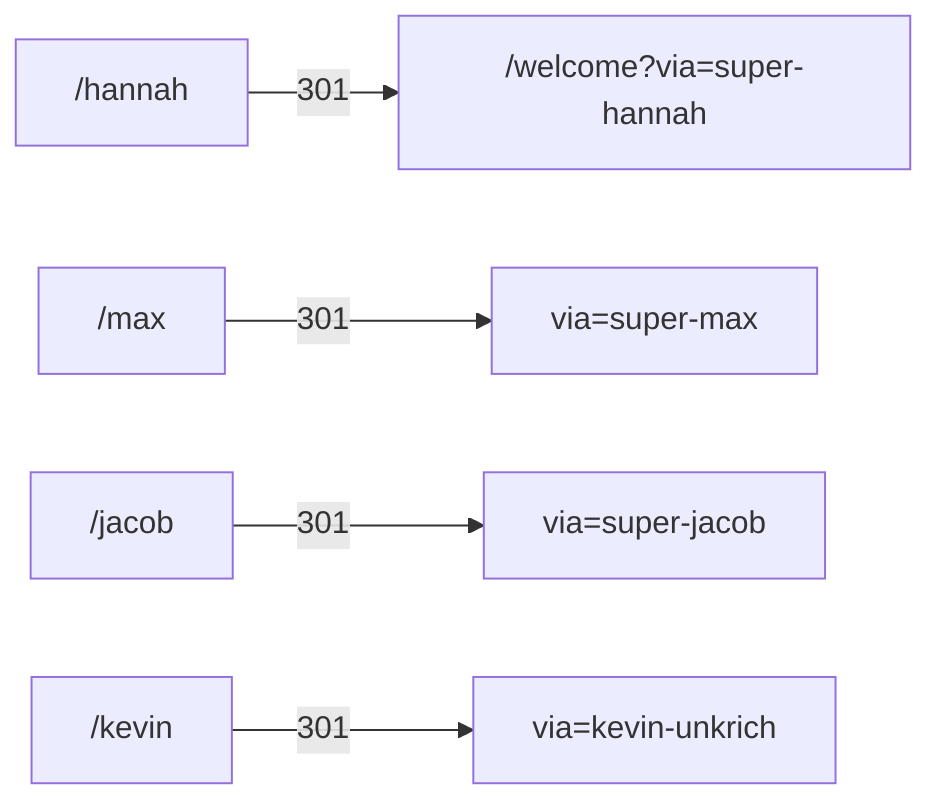

# Special topic — Hannah Ahn (inbound / on-site)

**Compiled:** 2026-09-09 (Australia/Sydney)  
**Lane:** Official-site inbound  
**Seed:** Hannah Ahn — early non-biomed / Head of Design  
**Verdict:** On-site confirms role + recruiting gravity; no dedicated bio page.

---

## On-site facts

| Claim | Evidence |
| --- | --- |
| Title | **“Hannah, Superpower’s Head of Design”** |
| Source | [Why I joined — Jason Combs](https://superpower.com/blog/why-i-joined-superpower-jason-combs) |
| Context | Jason (ex–Medium brand design) knew her from **design Twitter**; SF meetup → she was building the design team → he joined |
| Dedicated bio / team page | **None found** |
| Careers page name drop | **No** “Hannah” / “Ahn” string |
| Own “Why I joined” post | **No** `/blog/why-i-joined-superpower-hannah*` |

---

## Referral vanity path (same class as founders)

| Path | Result |
| --- | --- |
| https://superpower.com/hannah | **301 →** `/welcome?via=super-hannah` |
| Tracy / Aimee / Annie / Jason / Eric short paths | **404** (no vanity) |

**Read:** Hannah is in the **founder-class referral slug set** (`super-hannah`), not just a blog byline.

---

## Adjacent non-biomed design cluster (on-site)

Useful next seeds for the early non-biomed dig:

| Person | On-site signal | URL |
| --- | --- | --- |
| **Jason Combs** | Brand/content; recruited via Hannah | `/blog/why-i-joined-superpower-jason-combs` |
| **Tracy Chen** | Product design; **Daybreak** agency (Superpower was client ~2 yrs); worked closely with founders | `/blog/why-i-joined-superpower-tracy-chen` |
| **Aimee Lee** | Branding → Superpower brand rebuild | `/blog/why-i-joined-superpower-aimee-lee` |
| **Annie Whelan** | Benefits consulting → health tech (Spring Health, Found, Brightside) | `/blog/why-i-joined-superpower-annie-whelan` |

Daybreak also appears in site chrome historically (`daybreak-superpower.netlify.app` OG on 404).

---

## Gaps (hand to X / outbound)

- No LinkedIn / portfolio / prior employers on-site  
- No biomed claims on-site (consistent with non-biomed dig)  
- Full name “Hannah Ahn” not spelled on the Jason post (first name + title only)

---

*Inbound lane · ping only on material change (new bio page, vanity path change, join-post naming).*
