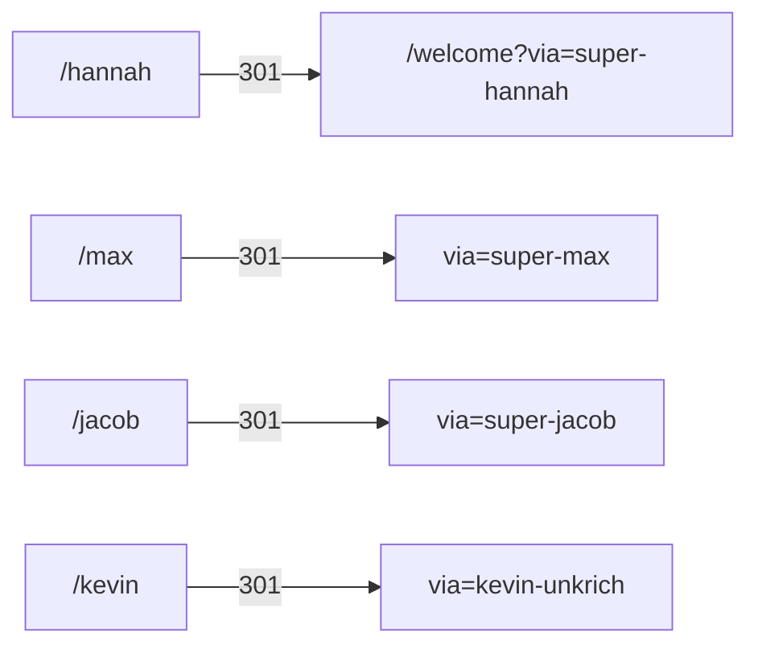
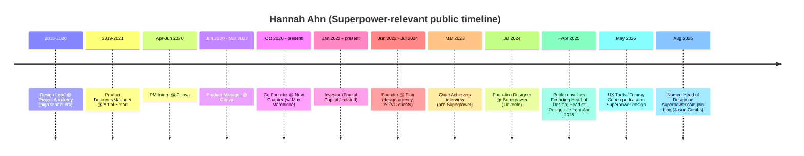

# Hannah Ahn — Early team pack (inbound + outbound)

**Subject:** Early / founding design leader at Superpower (non-biomedical lane)  
**Prepared:** 2026-09-09 (AEST)  
**Method:** WebSearch + WebFetch + selective curl of public pages. Prefer primary sources.  
**Status:** Consolidated diligence draft — no invention; gaps labeled.  
**Scope:** Official-site inbound + outbound (LinkedIn, CV, press/podcasts, personal) + X.

---

## TLDR

| Claim | Verdict | Confidence |
|---|---|---|
| Head of Design @ Superpower | **Supported** (LinkedIn title; Superpower blog; podcasts; company LinkedIn key exec list) | **High** |
| Also “Head of Design & Media” / leads design + marketing | **Supported** in interviews (YouTube self-ID; UX Tools / Substack bios) | **High** |
| Early / founding design seat | **Supported** as **Founding Designer** from **Jul 2024**; self-called **Founding Head of Design** on join announcement | **High** for early design lead; **not** named Superpower co-founder on Series A page |
| Non-biomed background | **Strong** — Canva PM, design agency (Flair), community (Next Chapter), angel investing; **no** clinical/MD/PhD trail found | **High** |
| Named on superpower.com careers / manifesto / Series A | **Not found** by name on those pages (checked 2026-09-09) | **High** (absence) |
| On-site name+title | **Yes** — careers blog “Why I joined” (Jason Combs) calls her **“Hannah, Superpower’s Head of Design”** | **High** |
| Founder-class vanity path | **`/hannah` → `via=super-hannah`** (same class as `/max`, `/jacob`, `/kevin`) | **High** |

**Identity disambiguation:** Do **not** confuse with **Hannah Ahn, Senior Designer @ NYT T Brand** ([hannahahn.work](https://hannahahn.work/), LinkedIn `hannahahn-work`) — different person/portfolio.

| Field | Value | Confidence | Source type |
|---|---|---|---|
| Full name | Hannah Ahn | High | LinkedIn, Village, X, UX Tools |
| Superpower role(s) | Founding Designer (~Jul 2024); Head of Design (~Apr 2025); also “Head of Design & Media” / leads design & marketing | High (titles); Medium (marketing wording varies) | LinkedIn, UX Tools, X bio |
| Location | San Francisco, CA (originally Sydney, Australia) | High | Read.cv, Village, LinkedIn |
| Biomedical training? | **No evidence of MD/PhD/clinical degree.** Design / PM / CS (discontinued). | High for “non-biomed” | Village + career history |
| Work email (public) | hannah@superpower.com | Medium–High | Read.cv (search/index snippet) |

---

## On-site (inbound)

**Lane:** Official-site inbound  
**Verdict:** On-site confirms role + recruiting gravity; no dedicated bio page.

### On-site facts

| Claim | Evidence |
| --- | --- |
| Title | **“Hannah, Superpower’s Head of Design”** |
| Source | [Why I joined — Jason Combs](https://superpower.com/blog/why-i-joined-superpower-jason-combs) |
| Context | Jason (ex–Medium brand design) knew her from **design Twitter**; SF meetup → she was building the design team → he joined |
| Dedicated bio / team page | **None found** |
| Careers page name drop | **No** “Hannah” / “Ahn” string |
| Own “Why I joined” post | **No** `/blog/why-i-joined-superpower-hannah*` |

### Page-by-page check (2026-09-09)

| Page | URL | Hannah Ahn mention? | Notes |
|---|---|---|---|
| Homepage | https://superpower.com/ | **No** | Product/doctors only |
| Careers | https://superpower.com/careers | **No by name** | “Meet the team” present; fetched HTML had no “Hannah”/“Ahn” |
| Manifesto / About | https://superpower.com/manifesto | **No** | Medical advisors named; not design leadership |
| Series A | https://superpower.com/series-a | **No** | Signed Max Marchione (CEO), Jacob Peters (Exec Chair); “founding team” generic |
| Blog — Jason Combs | https://superpower.com/blog/why-i-joined-superpower-jason-combs | **Yes** | “I knew **Hannah, Superpower’s Head of Design**, from design Twitter…” (dated ~**Aug 25–27, 2026**) |
| Blog category Team | https://superpower.com/blog-categories/team | Index only | Lists join posts; not a bio page for Hannah |

**On-site takeaway:** Official consumer/company narrative pages do **not** list her as a named founder/exec. The clearest **first-party site** confirmation of title is a **2026 hire letter** naming her Head of Design. Full name “Hannah Ahn” is not spelled on the Jason post (first name + title only).

### Referral vanity path (same class as founders)

| Path | Result |
| --- | --- |
| https://superpower.com/hannah | **301 →** `/welcome?via=super-hannah` |
| Tracy / Aimee / Annie / Jason / Eric short paths | **404** (no vanity) |

**Read:** Hannah is in the **founder-class referral slug set** (`super-hannah`), not just a blog byline.

### Adjacent non-biomed design cluster (on-site)

Useful next seeds for the early non-biomed dig:

| Person | On-site signal | URL |
| --- | --- | --- |
| **Jason Combs** | Brand/content; recruited via Hannah | `/blog/why-i-joined-superpower-jason-combs` |
| **Tracy Chen** | Product design; **Daybreak** agency (Superpower was client ~2 yrs); worked closely with founders | `/blog/why-i-joined-superpower-tracy-chen` |
| **Aimee Lee** | Branding → Superpower brand rebuild | `/blog/why-i-joined-superpower-aimee-lee` |
| **Annie Whelan** | Benefits consulting → health tech (Spring Health, Found, Brightside) | `/blog/why-i-joined-superpower-annie-whelan` |

Daybreak also appears in site chrome historically (`daybreak-superpower.netlify.app` OG on 404).

### Inbound gaps (hand to outbound)

- No LinkedIn / portfolio / prior employers on-site  
- No biomed claims on-site (consistent with non-biomed dig)  
- Full name “Hannah Ahn” not spelled on the Jason post (first name + title only)

---

## Off-site (outbound)

### Public profiles (primary)

| Channel | URL / handle | Notes | Label |
|---|---|---|---|
| LinkedIn | https://www.linkedin.com/in/ahnhannah | Headline often “Design @ Superpower”; lists Head of Design + Founding Designer; about “Last updated: **15 Apr 2025**” | [primary — LinkedIn] |
| X / Twitter | **@hannah_ahn** | Live profile title “Hannah Ahn (@hannah_ahn)”; og:description: `propagating hearsay ⋆ head of design @superpower ⋆ human` (fetched 2026-09-09) | [primary — X] |
| X (legacy citation) | twitter.com/_hannahahn | Cited on LinkedIn/Village “About” text. Curl of `twitter.com/_hannahahn` returned **404 User Profile Not Found** (2026-09-09). **Current handle is `@hannah_ahn`** (legacy `@_hannahahn` dead). **[inferred]** rename/migration. | [primary citation + off-site gap] |
| Read.cv | https://read.cv/ahn | Search/index: “Founding Designer at Superpower”; designer from Sydney; leads design & marketing; prior Canva + own studio; email `hannah@superpower.com`. Direct fetch returned **402 Payment Required** (2026-09-09). | [primary intended; access gap] |
| Personal site | https://www.hannah-ahn.com/ (linked from Read.cv snippets) | Curl returned `DEPLOYMENT_DISABLED` (2026-09-09). | [off-site / access gap] |
| Village (aggregator) | https://village.ai/person/hannah-ahn-NTY5MTgzMDQ1 | Mirrors LinkedIn-style experience + About (incl. X citation); Flair / Canva dates | [secondary aggregator of LinkedIn-like data] |
| Signal (NFX) | https://signal.nfx.com/investors/hannah-ahn | Investor Ultraviolet Ventures; also lists Fractal, Flair, Superpower roles | [secondary — investor listing] |
| GitHub (LinkedIn lists) | https://github.com/ahnhannah | Username only; not reviewed for code | [secondary] |
| UX Tools podcast | https://www.uxtools.co/episodes/ai-made-junior-designers-look-like-most-seniors-hannah-ahn | Episode dated May 5, 2026; “leads design and marketing at Superpower”; prior PM path via Canva | [primary interview page] |

### Role at Superpower

1. **Founding Head of Design / Founding Designer**  
   - LinkedIn announcement post (activity `…7320477137822445568…`, indexed around Series A window ~22 Apr 2025): joined as “Founding Head of Design”; “over the past 9 months” at the SF startup.  
   - Village/LinkedIn timeline: **Founding Designer Jul 2024 – Present**; **Head of Design Apr 2025 – Present**.  
   - **[inferred]** ~9 months before Apr 2025 announcement ≈ Jul 2024 start — consistent with Village dates.  
   - Labels: [primary — LinkedIn post]; [secondary — Village timeline]

2. **Scope includes design + marketing / brand**  
   - Read.cv snippet: “I lead design & marketing at Superpower.”  
   - UX Tools: “She leads design and marketing at Superpower.”  
   - X bio (2026-09-09): “head of design @superpower” (does not itself claim marketing).  
   - YouTube self-ID: “**head of design and media** at Superpower” — [primary interview].  
   - SuperX creator page (third-party): “Head of Design & Media @superpower” — treat as **[secondary]**.  
   - Jacob Peters LinkedIn hiring post (search snippet, ~Jun 2025): refers to Hannah Ahn as brand designer partnering with CMO Ben Acott — supports brand/design centrality **[primary — LinkedIn via search]**.

3. **Relationship to founders**  
   - LinkedIn announcement: “working alongside a long-time friend and thought partner, Max Marchione”; thanks Jacob Peters, Kevin Unkrich, Ajay Prakash, Albe T., among others.  
   - Next Chapter: “**Max Marchione and I** started Next Chapter…” — prior relationship to Superpower CEO.  
   - Label: [primary — LinkedIn posts]

4. **Company LinkedIn key execs**  
   - LinkedIn company Superpower lists **Hannah Ahn: Head of Design** alongside Max Marchione Co-Founder, Manoj Arachige Head of Product, etc. — [primary — company page]

### Prior companies / activities (non-biomed)

| Period (approx.) | Role / org | Notes | Source label |
|---|---|---|---|
| Jun 2022 – Jul 2024 | Founder, **Flair** (solo design agency) | “Scaled my solo design agency to $50k MRR. Brand + web for top YC and VC-backed startups.” | [secondary — Village]; Quiet Achievers |
| Jun 2020 – Mar 2022 | Product Manager, **Canva** | “Pitched myself to work at Canva in high school and joined as a 17 y/o.” UX Tools frames path as PM → design. | [secondary — Village]; [primary — UX Tools] |
| Apr 2020 – Jun 2020 | Product Management Intern, Canva | | [secondary — Village] |
| Oct 2020 – Present | Co-Founder, **Next Chapter** | Private members’ club for young founders & investors (nextchapter.to); co-founded with Max Marchione | [secondary — Village]; [LinkedIn About / posts] |
| Jan 2022 – Present | Investor, **Fractal Capital** | Angel investing; also Ultraviolet Ventures (Signal) | [secondary — Village / Signal] |
| 2018–2021 (misc.) | Project Academy (Design Lead), Art of Smart (PD/PM), Quest Media (Content Lead), AfterWork Ventures (Investment Intern) | High-school / early career design & product | [secondary — Village] |

**No biomedical employers or clinical roles found** in public career history reviewed.

### Education

| School | Credential | Notes | Label |
|---|---|---|---|
| UNSW | B. Computer Science / Science (**Discontinued**) | Mike Cannon–Brookes scholarship then dropout (Quiet Achievers) | [secondary — Village]; Quiet Achievers |
| Chatswood High School | Secondary | Sydney | [secondary — Village] |

**Biomedical training:** None found (no medicine, nursing, biology PhD, etc.). Computer Science / Science discontinued ≠ biomedical professional training for this lane’s purposes.

### Press / podcasts / video

| Source | URL | Date | Claims |
|---|---|---|---|
| UX Tools episode | https://www.uxtools.co/episodes/ai-made-junior-designers-look-like-most-seniors-hannah-ahn | **May 5, 2026** | Leads design and marketing at Superpower; prior PM at Canva; ~5-person design team |
| Tommy on Design (Substack audio) | https://designertom.substack.com/p/ai-made-junior-designers-better-than-ff5 | **May 5, 2026** | Same episode mirror |
| YouTube interview | https://www.youtube.com/watch?v=IiZhJ26ZSVI | oEmbed title live | Title: *Storytelling & Branding in Tech \| Hannah Ahn (Superpower)*; self-ID: “**head of design and media** at Superpower” |
| Quiet Achievers (AU) | https://www.quietachievers.au/interviews/hannah-ahn | Interviewed **Mar 2023** (pre-Superpower) | Korean Australian; Flair; Next Chapter co-founder; left Canva PM; UNSW scholarship then dropout |
| Quiet Achievers Substack | https://quietachievers.substack.com/p/hannah-ahn | Same interview | Same bio |

### Company / third-party listings

| Source | URL | Claims |
|---|---|---|
| LinkedIn company Superpower | https://linkedin.com/company/superpower | Key executives include **Hannah Ahn: Head of Design** |
| Rob Figueredo project page (search hit) | https://www.robably.net/projects/superpower | Search snippet: Superpower work **2024**, **Director: Hannah Ahn** — **page 404 on fetch 2026-09-09**; treat as **unverified** until archive recovered |

### Notable self-posts (LinkedIn)

| Post | Approx. timing | Claims |
|---|---|---|
| [“I have a secret…”](https://www.linkedin.com/posts/ahnhannah_i-have-a-secret-ive-been-dying-to-share-activity-7320477137822445568-c7HF) | Aligns with **~Apr 2025** public unveil (after “past **9 months**” + Founding Designer Jul 2024) | Joined as **Founding Head of Design**; design agency serving “hundreds” of YC/VC startups; long-time friend / thought partner **Max Marchione**; tags Jacob Peters, Ajay Prakash, etc. |
| [Left Canva PM](https://www.linkedin.com/posts/ahnhannah_i-left-my-6-figure-job-as-a-product-manager-activity-6939845837388673024-oQo7) | Dated **2022-06-07** in search snippet | Left Canva product management |
| [Next Chapter apps](https://www.linkedin.com/posts/ahnhannah_next-chapter-join-the-community-for-the-activity-7230033374772404225-6AXN) | Search dated **2024-08-16** | “**Max Marchione and I** started Next Chapter…” — prior relationship to Superpower CEO |

### Career timeline (public)

*Dates for Flair / Canva / Next Chapter primarily from Village.ai LinkedIn mirror + Quiet Achievers + LinkedIn posts. Prefer primary LinkedIn for employment dates.*

### Non-biomed background — evidence

| Signal | Evidence | Biomed? |
|---|---|---|
| Canva PM / intern | LinkedIn, Village, Quiet Achievers, podcasts | No |
| Flair design agency (YC/VC startups) | Village, Quiet Achievers, join post | No |
| Next Chapter (young founders club) | LinkedIn, Quiet Achievers; co-founded with Max Marchione | No |
| Angel / VC investing | Fractal Capital; Ultraviolet Ventures (Signal) | No |
| Education | Chatswood HS; UNSW Comp Sci/Science **discontinued** (scholarship then dropout) | No clinical degree found |
| Superpower remit | Brand, product design, media/marketing leadership | Design/ops — **not** clinical |

**Conclusion:** Hannah Ahn fits the **early non-biomed core** lane: design/brand leadership, consumer/tech product path (Canva PM, agency), Australia → SF founder network. Passion for health is stated personally/missionally; that is **not** biomedical credentials.

**No public evidence found** of MD, nursing, PhD-biomed, lab science, or clinical practice roles for this Hannah Ahn.

### Early-core assessment

| Criterion | Assessment |
|---|---|
| Company founded | **2023** (LinkedIn company data) |
| Her start | **Jul 2024** Founding Designer → ~1 year after founding |
| “Founding” language | Self + LinkedIn **Founding Designer / Founding Head of Design** |
| Relationship to founders | Long-time collaborator with **Max Marchione** via **Next Chapter** (co-founders); named in join post |
| Named on Series A / manifesto exec line | **No** |
| Design org leadership | Multiple 2026 sources: leads ~5-person design; Head of Design & Media |
| Vanity referral slug | **`super-hannah`** — founder-class set |

**Confidence she is early non-biomed core:** **High** for *early Head of Design / founding designer (non-clinical)*.  
**Confidence she is a Superpower legal co-founder / day-0 founder:** **Low–moderate** — title is “founding designer,” not listed with Max/Jacob on Series A letter; prior Next Chapter co-founder with Max is well supported; vanity path is founder-class.

---

## Key URLs

**On-site**

- https://superpower.com/hannah → `/welcome?via=super-hannah`  
- https://superpower.com/blog/why-i-joined-superpower-jason-combs  
- https://superpower.com/careers · https://superpower.com/manifesto · https://superpower.com/series-a *(negative findings)*  

**Off-site**

1. https://www.linkedin.com/in/ahnhannah  
2. https://www.linkedin.com/posts/ahnhannah_i-have-a-secret-ive-been-dying-to-share-activity-7320477137822445568-c7HF  
3. https://x.com/hannah_ahn  
4. https://read.cv/ahn  
5. https://village.ai/person/hannah-ahn-NTY5MTgzMDQ1  
6. https://www.uxtools.co/episodes/ai-made-junior-designers-look-like-most-seniors-hannah-ahn  
7. https://designertom.substack.com/p/ai-made-junior-designers-better-than-ff5  
8. https://www.youtube.com/watch?v=IiZhJ26ZSVI  
9. https://www.quietachievers.au/interviews/hannah-ahn  
10. https://linkedin.com/company/superpower  
11. https://signal.nfx.com/investors/hannah-ahn  
12. https://www.hannah-ahn.com/  

---

## X

**Handle:** [@hannah_ahn](https://x.com/hannah_ahn) (not `@_hannahahn`)  
**Bio:** propagating hearsay ⋆ head of design @superpower ⋆ human  
**Joined:** Oct 2018 · SF · **75.7K** followers · blue verified

### Key posts

| Topic | Status ID | Notes |
| --- | --- | --- |
| Pinned — hire creatives | [`1975675919806419046`](https://x.com/hannah_ahn/status/1975675919806419046) | Oct 7 2025 · 888K views |
| Design squad hire tease | [`1999236065417425277`](https://x.com/hannah_ahn/status/1999236065417425277) | Names @nilseller @flornkm @jarviswang__ |
| Design engineer hire | [`1999235559362121866`](https://x.com/hannah_ahn/status/1999235559362121866) | Dec 11 2025 |
| New healthcare system | [`2067661561985151254`](https://x.com/hannah_ahn/status/2067661561985151254) | Jun 18 2026 · design team &lt;5 |
| Jason Combs join | [`2086847117285531781`](https://x.com/hannah_ahn/status/2086847117285531781) | Aug 10 2026 |

### Friendship / early circle (Superpower-adjacent)

| Tier | Person | Handle | Evidence |
| --- | --- | --- | --- |
| A | Max Marchione | @maxmarchione | Long-time friend; vision embeds |
| A | Jason Combs | @jasonsbmoc | Joining Superpower brand |
| A | Nils Eller | @nilseller | Named “design squad” |
| A | Flor | @flornkm | Named “design squad” |
| A | Jarvis Wang | @jarviswang__ | Named “design squad” |
| B | Joumana Elomar | @JoumanaElomar | Unveil + ongoing creative |
| B | Josh Puckett | @joshpuckett | “design dream team” |

No confirmed X handles for Tracy Chen / Aimee Lee / Annie Whelan in this scrape.

### Screenshots

- [X profile](assets/hannah-ahn-x-profile.png)
- [Design squad hire tease](assets/hannah-ahn-design-squad.png)

---

## Gaps / open questions

- [gap] Exact employment contract start date vs LinkedIn “Jul 2024” (Village).  
- [gap] Whether “Head of Design & Media” is an official title or informal/third-party wording.  
- [gap] Full Read.cv and hannah-ahn.com content (paywall / deployment disabled at fetch time).  
- [gap] Formal education completion status beyond “Discontinued” CS/Science.  
- [gap] No verified Behance/Dribbble for **this** Hannah tied to Superpower.  
- [gap] Robably Superpower project page **404** — Director credit unverified.  
- [gap] Exact legal equity / “founding team” definition not public.  
- [off-site] LinkedIn full HTML not scraped; details taken from search snippets + Village mirror + public posts. Re-verify on LinkedIn UI.  
- [off-site] X deep-dive folded under ## X (status IDs + friendship circle); full historical archive still incomplete.

---

*Compiled for due diligence. Do not treat as employment verification or background check. Inbound+outbound merged into one early-team file.*
