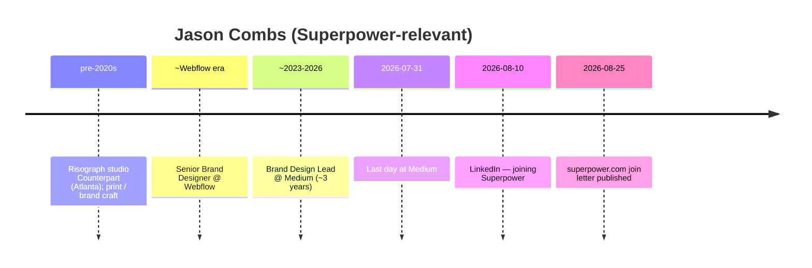

# Jason Combs — Early team pack (inbound + outbound)

**Subject:** Design (brand / creative) at Superpower — **2026 hire**, not founding core  
**Prepared:** 2026-09-09 (AEST)  
**Method:** WebSearch + WebFetch + curl of public pages. Prefer primary sources.  
**Status:** Consolidated diligence draft — no invention; gaps labeled.  
**Scope:** Official-site inbound + outbound (LinkedIn, portfolio, press).  
**Recruited via:** **Hannah** (Head of Design) — his own join letter.

---

## TLDR

| Claim | Verdict | Confidence |
|---|---|---|
| Full name **Jason Combs**; Design @ Superpower | **Supported** (careers Meet the team + join blog + LinkedIn) | **High** |
| Brand / creative (not product eng; not clinical) | **Supported** — ex–Medium Brand Design Lead; blog: creative direction / content / media | **High** |
| Joined **Aug 2026** | **Supported** — LI announce **2026-08-10**; left Medium **2026-07-31**; blog dated **Aug 25, 2026** | **High** |
| Recruited via **Hannah** (Head of Design) | **Supported** — his own join letter | **High** |
| Based **Chicago** → brand remote-eligible | **Supported** (blog + LI); careers FAQ allows brand/creative remote | **High** |
| Early founding-core | **Not supported** — ~Aug 2026 hire into existing design org | **High** (absence) |
| Non-biomed | **Strong** — print/risograph, Webflow, Medium brand | **High** |
| Founder-class vanity `/jason` | **404** — no short vanity (unlike Hannah `/hannah`) | **High** |

**Identity disambiguation:** Not the dialysis/healthcare CEO Jason Combs (different person). Target is designer LinkedIn `jason-combs-081862262`.

---

## On-site (inbound)

**Lane:** Official-site inbound (checked **2026-09-09**).

| Signal | URL | Result |
|---|---|---|
| Vanity short path | https://superpower.com/jason | **404** — no founder-class vanity |
| Join blog (author letter) | https://superpower.com/blog/why-i-joined-superpower-jason-combs | **200** — **Written by Jason Combs · August 25, 2026** |
| Author / Meet page | https://superpower.com/author/jason-combs | **200** — “Meet Jason Combs, Design” |
| Careers — Meet the team | https://superpower.com/careers | **Yes** — name + **Design** + slug → join blog |

**On-site takeaway:** Strong first-party presence via careers CMS + join letter + author page. **No** founder-class vanity path. Names **Hannah** as Head of Design / recruiter in the Aug 25 letter.

---

## Role snapshot

| Field | Public claim | Source class |
|---|---|---|
| Careers card | **Jason Combs — Design** | superpower.com/careers Meet the team |
| LinkedIn headline / dept | Design @ Superpower | LinkedIn |
| Function detail | Brand / content; creative direction for media work | Join blog |
| Location | Chicago, IL (partner + cat Corndog) | Join blog; LinkedIn |
| Prior | Brand Design Lead / Senior Brand Designer @ **Medium** (~3 yrs); Senior Brand Designer @ **Webflow**; earlier Adobe / Abstract / Matchstic | LinkedIn; blog |
| Personal site | https://jasonsbmoc.com/ (still showed Medium title on fetch — stale) | Portfolio |

---

## Off-site (outbound)

| Source | URL | Claims |
|---|---|---|
| LinkedIn | https://www.linkedin.com/in/jason-combs-081862262 | Design @ Superpower; Chicago; prior Medium / Webflow |
| Join announce | https://www.linkedin.com/posts/jason-combs-081862262_thrilled-to-share-that-today-im-joining-activity-7492590973751808000-TFP8 | **2026-08-10** — joining Superpower to shape brand |
| Left Medium | https://www.linkedin.com/posts/jason-combs-081862262_today-was-my-last-day-at-medium-its-been-activity-7489085927898914816-lwTl | **2026-07-31** last day at Medium |
| Portfolio | https://jasonsbmoc.com/ | Personal; LI points here |
| Lapa / older bio | https://www.lapa.ninja/post/jasonsbmoc/ | Historical Webflow + Counterpart risograph context |

---

## Career timeline (public)

---

## Non-biomed + early-core

| Signal | Evidence | Biomed? |
|---|---|---|
| Brand design Medium / Webflow | LI + blog | No |
| Print / risograph | Blog + older bios | No |
| Superpower remit | Design / brand / media content | Design — **not** clinical |

**Early-core flag:** **Not early core.** High-confidence **2026 design hire** into Hannah’s org. Useful adjacency to Head of Design, not founding-era.

---

## Key URLs

1. https://superpower.com/blog/why-i-joined-superpower-jason-combs  
2. https://superpower.com/author/jason-combs  
3. https://superpower.com/careers  
4. https://www.linkedin.com/in/jason-combs-081862262  
5. https://www.linkedin.com/posts/jason-combs-081862262_thrilled-to-share-that-today-im-joining-activity-7492590973751808000-TFP8  
6. https://jasonsbmoc.com/  

---

*Compiled for due diligence. Do not treat as employment verification.*  
*Merged from outbound pack + on-site inbound (vanity/blog/author).*
