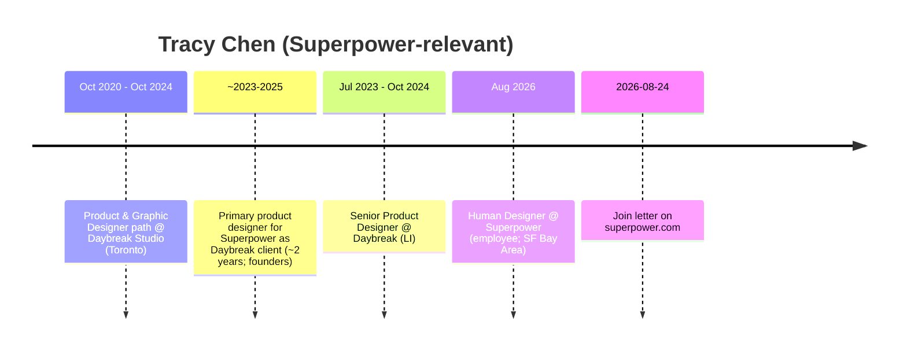

# Tracy Chen — Early team pack (inbound + outbound)

**Subject:** Design / Product Design (“Human Designer”) at Superpower — **Aug 2026 employee**; **~2 yr** prior Daybreak client relationship (highest early-relationship in this set)  
**Prepared:** 2026-09-09 (AEST)  
**Method:** WebSearch + WebFetch + curl of public pages. Prefer primary sources.  
**Status:** Consolidated diligence draft — no invention; gaps labeled.  
**Scope:** Official-site inbound + outbound (LinkedIn, portfolio, Fonts In Use).

---

## TLDR

| Claim | Verdict | Confidence |
|---|---|---|
| Full name **Tracy Chen**; Design @ Superpower | **Supported** (careers + join blog + LI `traucy`) | **High** |
| Product / “Human Designer”; worked closely with eng/code | **Supported** (blog; LI title Human Designer; careers earlier scrapes said Product Design) | **High** |
| Employee start **Aug 2026**; SF Bay Area | **Supported** (LinkedIn Aug 2026 – Present, Bay Area) | **High** |
| Prior: primary product designer for Superpower **as Daybreak client ~2 years** | **Supported** (own join letter); portfolio case study indexed at traucy.com (direct fetch 404 this pass) | **High** |
| Canada origin | **Supported** (join letter) | **High** |
| Non-biomed | **Strong** — agency product/graphic design | **High** |
| Early non-biomed core | **High for relationship / product continuity**; **Low for employee tenure** (joined Aug 2026) | Split |
| Founder-class vanity `/tracy` | **404** — no short vanity | **High** |

**Identity disambiguation:** Not Tracy Chen / Tracy L. Chen (MongoDB / Studio T, NY) nor other LinkedIn Tracy Chens. Target: **https://www.linkedin.com/in/traucy** + Daybreak + Superpower client history.

---

## On-site (inbound)

**Lane:** Official-site inbound (checked **2026-09-09**).

| Signal | URL | Result |
|---|---|---|
| Vanity short path | https://superpower.com/tracy | **404** — no founder-class vanity |
| Join blog (author letter) | https://superpower.com/blog/why-i-joined-superpower-tracy-chen | **200** — **Written by Tracy Chen · August 24, 2026** |
| Author / Meet page | https://superpower.com/author/tracy-chen | **200** — “Meet Tracy Chen, Design” |
| Careers — Meet the team | https://superpower.com/careers | **Yes** — Design + join slug |

**On-site takeaway:** Named on careers + full join letter + author page. Strongest “worked with founders before hire” narrative of the Jason/Tracy/Aimee/Annie set (Daybreak client ~2 yrs). **Not** a founder-class vanity slug.

---

## Role snapshot

| Field | Public claim | Source class |
|---|---|---|
| Careers card | **Tracy Chen — Design** | careers Meet the team (live HTML 2026-09-09) |
| LinkedIn | **Human Designer** @ Superpower; Aug 2026 – Present; SF Bay Area | LinkedIn |
| Function | Product design; code-adjacent; prior agency PD for Superpower | Join blog |
| Prior | **Daybreak Studio** — Senior Product Designer (Jul 2023 – Oct 2024 scrape); Product & Graphic Designer Oct 2020 – Oct 2024 | LinkedIn |
| Personal / case study | https://www.traucy.com/superpower.html (indexed; **404 on fetch 2026-09-09**) | Secondary / gap |
| Fonts In Use | Superpower ~2024 credited via Daybreak | https://www.fontsinuse.com/designers/24702/tracy-chen |

---

## Off-site (outbound)

| Source | URL | Claims |
|---|---|---|
| LinkedIn | https://www.linkedin.com/in/traucy | Designer / Human Designer @ Superpower; Daybreak history |
| Portfolio (indexed) | https://www.traucy.com/superpower.html | Daybreak Superpower case: PD Tracy Chen; CD Taha Hossain; Motion Ross Chan |
| Fonts In Use | https://www.fontsinuse.com/designers/24702/tracy-chen | Superpower ~2024 Daybreak credit |

---

## Career timeline (public)

---

## Non-biomed + early-core

| Signal | Evidence | Biomed? |
|---|---|---|
| Daybreak agency design | LI + blog + Fonts In Use | No |
| Product design / code curiosity | Join letter | No |
| Superpower remit | Product/design IC | Design — **not** clinical |

**Early-core flag:** **Highest early-relationship score in this quartet** (multi-year designer on Superpower while at Daybreak, closely with founders). **Not** a 2023–24 *employee* founding hire — employee tenure starts **Aug 2026**. Careers FAQ implies **product design = SF in-person**.

---

## Key URLs

1. https://superpower.com/blog/why-i-joined-superpower-tracy-chen  
2. https://superpower.com/author/tracy-chen  
3. https://superpower.com/careers  
4. https://www.linkedin.com/in/traucy  
5. https://www.traucy.com/superpower.html *(indexed; fetch 404 this pass — recheck)*  
6. https://www.fontsinuse.com/designers/24702/tracy-chen  

---

*Compiled for due diligence. Do not treat as employment verification.*  
*Merged from outbound pack + on-site inbound (vanity/blog/author).*
