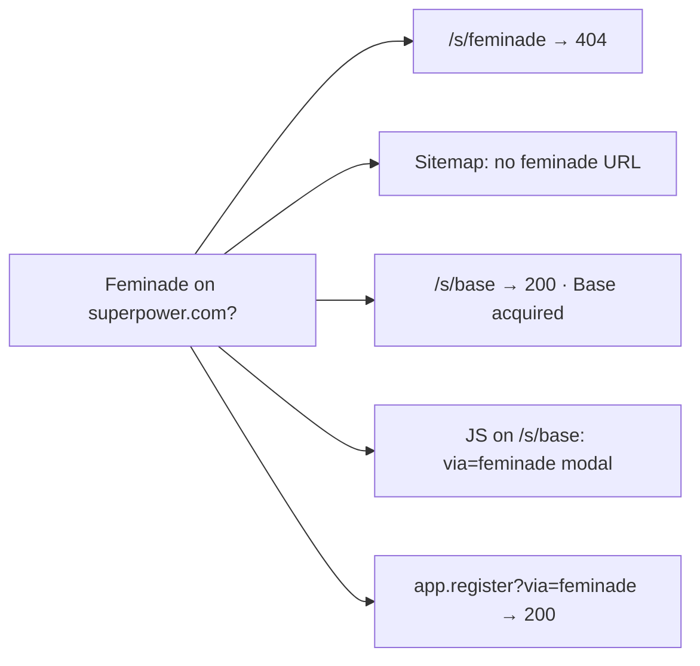

# Special topic — Feminade (inbound / on-site)

**Compiled:** 2026-09-09 (Australia/Sydney)  
**Lane:** Official-site inbound tree  
**Verdict:** Acquisition is **not** documented as a public marketing page on superpower.com. Only residual referral plumbing remains.

---

## On-site status



| Check | Result | Source |
| --- | --- | --- |
| `/s/feminade` | **HTTP 404** (“Even our superpowers can’t locate this page.”) | https://superpower.com/s/feminade |
| Sitemap webflow | **No** `feminade` / no `/s/feminade` | https://superpower.com/sitemap-webflow.xml |
| `/s/base` | **200** — “Base has been acquired by Superpower…” | https://superpower.com/s/base |
| Homepage copy | **No** Feminade mention | https://superpower.com/ |
| Blog origin story | Founders Jacob / Max / **Kevin** (first name); **no** Feminade | https://superpower.com/blog/superpower-is-now-199 |

Contrast: Base has a dedicated acquisition LP; Feminade does not.

---

## Residual on-site plumbing

On `/s/base`, embedded script still watches the query string:

```js
const modal = document.querySelector('.feminade-modal');
if (currentUrl.includes('via=feminade')) {
  modal.style.display = 'flex';
} else {
  modal.style.display = 'none';
}
```

| Artifact | Status |
| --- | --- |
| `via=feminade` handler | Present in `/s/base` page JS |
| `.feminade-modal` element | Referenced in JS; **not** found as live markup in Sep 2026 HTML pull (likely removed or conditional) |
| `app.superpower.com/register?via=feminade` | **200** (referral param accepted) |
| `superpower.com/?via=feminade` | **200** (homepage; no feminade string in HTML) |

**Read:** Feminade was wired as a **referral / migrate-members** path, not a published acquisition story page like Base.

---

## Off-site (pointer for outbound lane)

Do **not** treat as on-site proof. Reported Jan 8, 2025:

| Source | Claim (summary) |
| --- | --- |
| [Axios Pro](https://www.axios.com/pro/health-tech-deals/2025/01/08/wellness-startup-superpower-women-focused-feminade) | Superpower acquires Feminade (cash + equity); Feminade CEO Roya Pakzad |
| [Femtech World](https://www.femtechworld.co.uk/news/feminade-founder-announces-acquisition-by-ai-health-startup-superpower/) | Hormone-health DTC; Pakzad transition contract, not long-term join |
| [Femtech Insider](https://femtechinsider.com/preventative-health-platform-superpower-acquires-feminade-to-strengthen-womens-health-offering/) | Women’s health offering; Jacob Peters quote |
| [Jacob LinkedIn](https://www.linkedin.com/posts/jacobdpeters_proud-to-be-continuing-the-feminade-mission-activity-7282832891070369793-jqa2) | “Continuing the Feminade mission within Superpower” |

Deal terms undisclosed in these writeups. Secondary: ~5k subscribers / lists / supplement-preference data (Axios echo).

---

## Watch

| Signal | Action |
| --- | --- |
| `/s/feminade` leaves 404 | Treat as material — update inbound-tree + this file |
| New `/s/*` acquisition LP | Same |
| `via=feminade` / `.feminade-modal` removed from `/s/base` | Note plumbing cleanup |
| On-site press/blog naming Feminade | Elevate from off-site-only |

---

---

## Related off-site residual branding (X)

Not on-site, but useful inbound context: Feminade’s X account still brands the acquisition and points members to Superpower.

| Asset | Evidence |
| --- | --- |
| [feminadeinc-x-profile.png](assets/feminadeinc-x-profile.png) | **[X]** Display name “Feminade (acquired by Superpower)”; link `superpower.com/welcome?via=fe…` — referral-style destination consistent with on-site `via=feminade` plumbing. Full write-up: [feminade.md](feminade.md). |

*Inbound lane · quiet weekday scrape — ping only on material change.*
