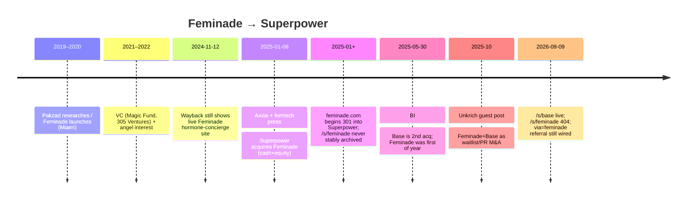
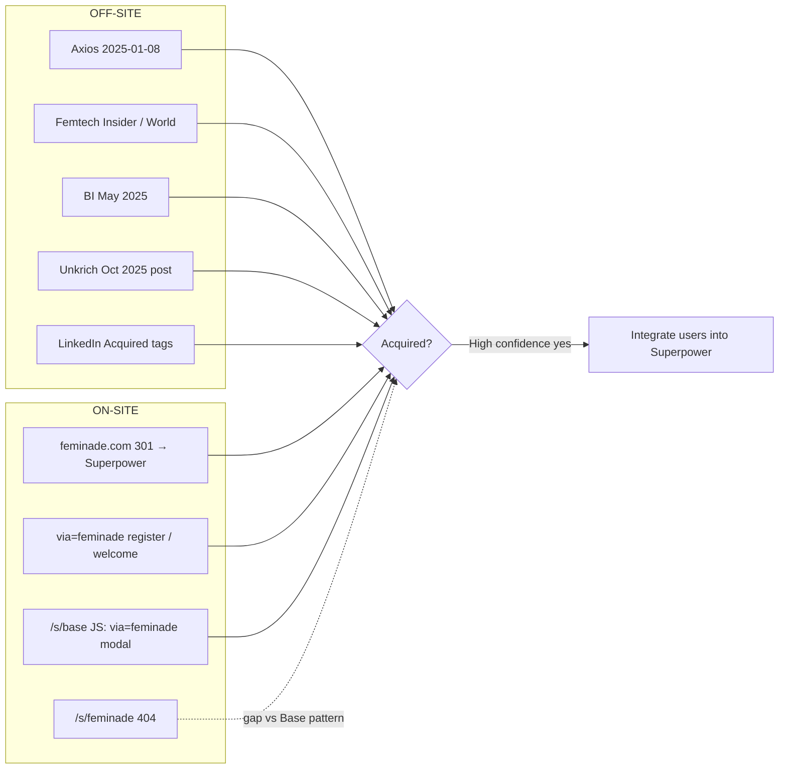

# Special topic — Feminade (outbound)

**As of:** 2026-09-09  
**Subject company:** Superpower Health, Inc. (`superpower.com`)  
**Question:** Did Superpower acquire Feminade? What is on-site vs outbound evidence?

---

## TLDR

| Claim | Verdict |
| --- | --- |
| Superpower acquired Feminade | **Very likely yes** (press + founder + domain redirect; no live `/s/feminade` page) |
| Deal timing | **Jan 8, 2025** (Axios exclusive; Femtech coverage same day) |
| Deal structure | Cash + equity; **terms undisclosed** |
| What Feminade was | Women’s hormone / functional-medicine DTC: at-home labs, telehealth, care plans (Miami; founded ~2020) |
| Founder | **Roya Pakzad** (CEO); CMO cited as **Dr Erin Rhae Biller**; post-deal contract transition only |
| Live Superpower Feminade landing | **`/s/feminade` = 404**; domain `feminade.com` now funnels into Superpower with `via=feminade` |
| Contrast with Base | **`/s/base` live** and explicitly states acquisition |

**Confidence on acquisition: High (~90%).** Multiple independent press outlets + founder confirmation + LinkedIn “Acquired by Superpower” + domain control. Gap: no dedicated live Superpower acquisition marketing page analogous to Base.

---

## What Feminade sold

From contemporaneous press and a pre-deal archive of `feminade.com` (Wayback **2024-11-12**):

- **Positioning:** Digital concierge for **women’s hormone health** (“root cause” of symptoms: PCOS, infertility, menopause, weight, acne, etc.).
- **Core offer:** Advanced **at-home diagnostic testing** (press emphasizes **dried urine hormone / metabolite** testing) + **telehealth** with functional / hormone practitioners + personalized plans; concierge membership with discounted labs and related resources.
- **HQ / founding:** Miami, FL; launched late **2020** (research/founding narrative from 2019).
- **Investors (pre-acq):** Magic Fund, 305 Ventures; angel narrative includes **Serena Williams** / Serena Ventures (per Femtech World).
- **Social (historical):** Instagram `@feminadeinc` (posts later framed as “Feminade is now Superpower”); founder `@royapakzad`.

---

## ON-SITE evidence (superpower.com / feminade.com)

| Check | Result (2026-09-09) | Notes |
| --- | --- | --- |
| `https://superpower.com/s/base` | **200** — explicit copy: *“Base has been acquired by Superpower…”* | Official acquisition landing pattern exists for Base |
| `https://superpower.com/s/feminade` | **404** | No parallel public Feminade acquisition page |
| Related paths (`/partners/feminade`, `/join/feminade`, etc.) | **404** | — |
| `https://superpower.com/feminade` | **301 →** `/welcome?via=feminade` **→** `/landing/welcome-v2?via=feminade` | Referral-style funnel, not an “acquired” announcement page |
| `https://feminade.com` | **301 →** `https://superpower.com/feminade` (then welcome-v2 `?via=feminade`) | Strong signal Superpower controls the brand domain |
| JS on `/s/base` | Script toggles **`.feminade-modal`** when URL contains **`via=feminade`** | Referral/modal plumbing; **modal DOM node appears missing** on current Base page (orphaned JS) |
| Register deep link | `https://app.superpower.com/register?via=feminade` → **200** | Affiliate/referral code still live |
| Wayback `superpower.com/s/feminade` | **No snapshots found** | Cannot confirm a former `/s/feminade` page from archive.org CDX |
| Indexed snippets (search) | Some Google snippets still show “Superpower has acquired Feminade” on unrelated Superpower URLs (e.g. HSA/FSA, LV Marathon) | **Not present** in live HTML of those pages when fetched 2026-09-09 — treat as **stale index / prior CMS**, not current on-site proof |

**On-site bottom line:** Superpower **does** document Base as acquired. For Feminade, live site shows **domain + `via=feminade` referral integration**, not a Base-style acquisition landing. Absence of `/s/feminade` is a documentation gap, not disproof.

---

## OFF-SITE claims (press, founders, social, secondary)

| Date | Source | Claim |
| --- | --- | --- |
| **2025-01-08** | [Axios Pro](https://www.axios.com/pro/health-tech-deals/2025/01/08/wellness-startup-superpower-women-focused-feminade) | **Exclusive:** Superpower acquired Feminade in **cash + equity**; Feminade CEO **Roya Pakzad** told Axios |
| **2025-01-08** | [Femtech Insider](https://femtechinsider.com/preventative-health-platform-superpower-acquires-feminade-to-strengthen-womens-health-offering/) | Acquisition to strengthen women’s health; quotes **Jacob Peters** (Superpower CEO); cash + equity undisclosed; Superpower then ~$4M pre-seed narrative |
| **~2025-01** | [Femtech World](https://www.femtechworld.co.uk/news/feminade-founder-announces-acquisition-by-ai-health-startup-superpower/) | Founder announces deal **Wed 8 Jan**; Pakzad on **contract transition**, **not** joining Superpower long-term; product/investor detail |
| **2025-05-30** | [Business Insider](https://www.businessinsider.com/ai-startup-superpower-acquiring-base-food-as-medicine-2025-5) | Base = **second** acquisition of 2025; Feminade bought in **January**; cofounders named (Peters, Marchione, **Kevin Unkrich** CTO) |
| **2025-10-12** | [Open Source CEO — Kevin Unkrich guest post](https://www.opensourceceo.com/p/superpower-guest-post) | Unkrich: acquired **Base and Feminade** to expand waitlist / PR; frames M&A as growth tactic (companies “winding down”) |
| Ongoing | [LinkedIn — Feminade Inc.](https://linkedin.com/company/feminade); [Roya Pakzad](https://www.linkedin.com/in/royapakzad) | Company/profile tagged **“Acquired by Superpower.com”** / “Built & Exited Feminade” |
| Databases | [CB Insights](https://www.cbinsights.com/company/feminade); Dealroom; Sacra | Stage **Acquired** (Jan 2025); Sacra: Feminade → PCOS / perimenopause / fertility protocols |
| Secondary | [Aytza “Bought Not Sold”](https://www.aytza.com/blogs/bought-not-sold) | Cites Feminade (Jan 2025) then Base (May 2025) as capability-expansion M&A |

### Kevin Unkrich / waitlist narrative

- Unkrich was Superpower **co-founder / CTO** (exited ~Mar 2026 per LinkedIn narrative in search).
- In the Oct 2025 guest post he **explicitly claims** Superpower acquired Feminade (and Base) as part of the **150k waitlist** growth playbook.
- Public X/tweet evidence in that post is shown for the **Base** announcement; Feminade is named in prose alongside Base, not as a separate linked tweet in the fetched article.
- Treat “Unkrich claimed Feminade acquisition” as **confirmed in his bylined post**, consistent with press — not merely rumor.

---

## Timeline (mermaid)

---

## Comparison: Base vs Feminade (official-site documentation)

| Dimension | Base | Feminade |
| --- | --- | --- |
| Dedicated `/s/{brand}` page | **Yes** — acquisition stated in hero | **No** — **404** |
| Brand domain | Separate Base story on Superpower | **`feminade.com` → Superpower** |
| Referral param | `via=base` on CTAs | `via=feminade` on register / welcome / Base JS |
| Press confirmation | Yes (e.g. BI May 2025) | Yes (Axios Jan 2025 + others) |
| Founder on record | Lola Priego / Base narrative in BI | Roya Pakzad on record to Axios / Femtech |

---

## Open gaps / caveats

1. **No live Superpower “we acquired Feminade” page** comparable to `/s/base` (and no Wayback of `/s/feminade`).
2. **Deal terms** never public.
3. **Google snippets** claiming acquisition copy on miscellaneous Superpower URLs appear **stale** vs live HTML.
4. Clinical note (from Femtech World): dried-urine hormone testing is **not mainstream**; peer-reviewed support described as limited — relevant to product characterization, not to whether the M&A occurred.

---

## Source URLs

### Official / on-site
- https://superpower.com/s/base  
- https://superpower.com/s/feminade *(404)*  
- https://feminade.com → https://superpower.com/feminade → https://superpower.com/landing/welcome-v2?via=feminade  
- https://app.superpower.com/register?via=feminade  
- Wayback (pre-deal Feminade): http://web.archive.org/web/20241112200636/https://www.feminade.com/

### Press / outbound
- https://www.axios.com/pro/health-tech-deals/2025/01/08/wellness-startup-superpower-women-focused-feminade  
- https://femtechinsider.com/preventative-health-platform-superpower-acquires-feminade-to-strengthen-womens-health-offering/  
- https://www.femtechworld.co.uk/news/feminade-founder-announces-acquisition-by-ai-health-startup-superpower/  
- https://www.businessinsider.com/ai-startup-superpower-acquiring-base-food-as-medicine-2025-5  
- https://www.opensourceceo.com/p/superpower-guest-post  
- https://www.cbinsights.com/company/feminade  
- https://sacra.com/c/superpower/  
- https://www.aytza.com/blogs/bought-not-sold  

### People / social
- https://linkedin.com/company/feminade  
- https://www.linkedin.com/in/royapakzad  
- https://www.instagram.com/feminadeinc/  
- https://tassonemd.com/podcast-21/ *(pre-acq product/founder context)*  

---

*Brief generated for special-topics pack. Separate ON-SITE technical checks (2026-09-09) from OFF-SITE reporting; acquisition confidence rests primarily on multi-source outbound confirmation plus domain redirect, despite missing `/s/feminade` landing.*
