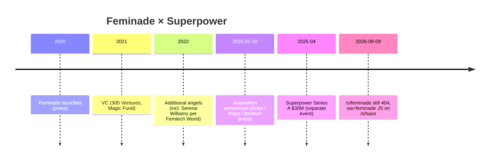
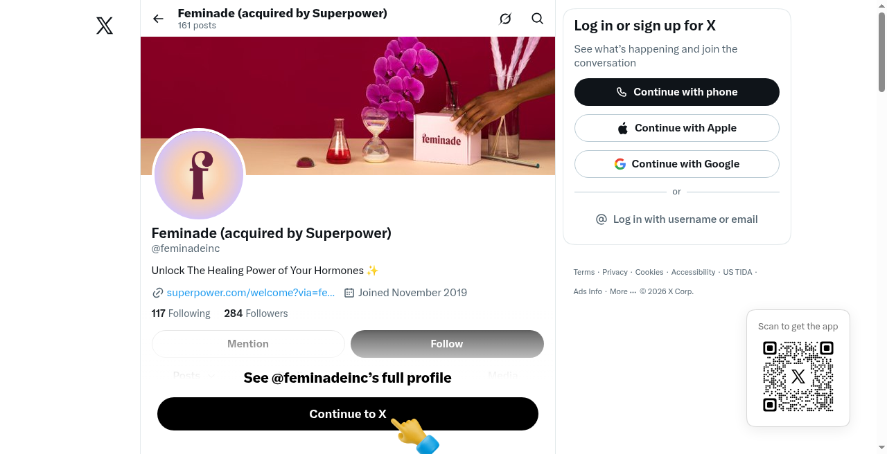

# Feminade — acquisition / relationship to Superpower

**Draft for company profile repo** · Compiled 2026-09-09 (Australia/Sydney)  
**Do not invent.** Claims tagged with source URL, **[X]**, **[off-site]**, or **[inferred]**.

---

## Snapshot

| Field | Detail | Source |
| --- | --- | --- |
| Target | **Feminade** (Feminade Inc.) — women’s hormone / functional health testing startup | Press + Roya LinkedIn |
| Acquirer | **Superpower** (Superpower Health) | Same |
| Announced | **2025-01-08** | Axios; Femtech Insider; Femtech World; Roya LinkedIn |
| Deal structure | Mix of **cash + equity**; terms **not disclosed** | Axios; Femtech Insider |
| Feminade founder | **Roya Pakzad** (Founder & CEO) | Same |
| Post-deal role (Roya) | Contract / transition support; **not** joining Superpower long-term | https://www.femtechworld.co.uk/news/feminade-founder-announces-acquisition-by-ai-health-startup-superpower/ |
| Official Superpower acquisition LP | **`/s/feminade` → 404** (confirmed 2026-09-09) | https://superpower.com/s/feminade |
| Contrast | **Base** has live acquisition landing `/s/base` | https://superpower.com/s/base |
| On-site residue | JS on Base landing: `.feminade-modal` + `via=feminade` query handling | `/s/base` HTML (curl 2026-09-09) |

---

## Primary / near-primary sources

| Source | Date | What it establishes |
| --- | --- | --- |
| Axios Pro exclusive | 2025-01-08 | Superpower acquired Feminade in cash+equity; Roya Pakzad told Axios | https://www.axios.com/pro/health-tech-deals/2025/01/08/wellness-startup-superpower-women-focused-feminade |
| Roya Pakzad LinkedIn | 2025-01-08 | “Feminade Inc. has been acquired by Superpower…”; thanks Jacob Peters | https://www.linkedin.com/posts/royapakzad_i-am-very-excited-to-share-that-feminade-activity-7282818998335897600-TPeA |
| Femtech Insider | 2025-01-08 | Origin story; dried urine hormone testing; Jacob quote; cash+equity; Superpower then at ~$4M pre-seed narrative | https://femtechinsider.com/preventative-health-platform-superpower-acquires-feminade-to-strengthen-womens-health-offering/ |
| Femtech World | ~Jan 2025 | Serena Williams / Serena Ventures angel; Pakzad not joining long-term; CMO Dr Erin Rhae Biller; hormone/perimenopause focus | https://www.femtechworld.co.uk/news/feminade-founder-announces-acquisition-by-ai-health-startup-superpower/ |

---

## What Feminade was (pre-deal)

| Aspect | Claim | Source |
| --- | --- | --- |
| Launch | Late **2020** | Femtech Insider |
| Focus | Affordable functional / hormone testing for women; irregular cycles, mood, weight, perimenopause/menopause | Femtech World; Femtech Insider |
| Flagship modality | **Dried urine** hormone tests (hormones + metabolites); root-cause framing (liver, gut, methylation language in press) | Femtech Insider; Femtech World |
| Founder catalyst | Pakzad’s severe birth-control side effects (~2018) / years of dismissal | Femtech Insider; Femtech World |
| Investors named in press | 305 Ventures, Magic Fund (2021); later angel including **Serena Williams** / Serena Ventures | Femtech Insider; Femtech World |
| Clinical | Brought on CMO / naturopathic practitioner **Dr Erin Rhae Biller** | Femtech World |
| Geography (directory) | Dealroom lists Miami | https://app.dealroom.co/news/feed/superpower-acquires-feminade-for-women-s-health **[off-site]** |

---

## Stated strategic rationale

Jacob Peters quote (press; title in articles often **CEO** at announcement time):

> “Healthcare today is fundamentally broken, especially for women. Feminade’s remarkable growth and deep expertise in women’s health make them the perfect partner to help us close this gap…”

Sources: Femtech Insider; Femtech World.

Roya: “Superpower is what I wanted Feminade to become eventually” (Femtech Insider); mission “living on through Superpower” (Femtech World).

Integration framing: Feminade community / expertise into Superpower platform; women’s health emphasis.

---

## Official Superpower site — evidence vs gap

| Check | Result (2026-09-09) | Implication |
| --- | --- | --- |
| https://superpower.com/s/feminade | **HTTP 404** | No dedicated acquisition landing comparable to Base |
| https://superpower.com/s/base | **200** — “Base has been acquired by Superpower” | Base is the documented M&A LP |
| `/s/base` HTML | `document.querySelector('.feminade-modal')` and `via=feminade` URL param | Referral / modal remnant only — **not** a full acquisition narrative |
| Homepage / Series A / manifesto | No Feminade acquisition section found in prior company brief crawl | Treat full Feminade story as **press-led**, not homepage-led |
| Some Intellimize/variant pages | Prior search snippets claimed Feminade “joining forces” copy on HSA-style landings | **Not reproduced** on live `/hsa-fsa-eligible` curl in this pass — flag as possible stale experiment |

Company brief already notes this conflict: `/workspace/superpower-health-company-brief.md` §6; `/workspace/superpower-health/inbound-tree.md`.

Local X pack note: *“Feminade | Kevin waitlist narrative claimed acquisition”* vs site incomplete — `/workspace/superpower-x/sources-x.md`. Treat Kevin/X waitlist claims as **secondary** unless a durable status URL is attached.

---

## Conflicts to flag

| Conflict | Detail |
| --- | --- |
| **Site vs press** | Press + Roya say acquired Jan 2025; Superpower still has **no** `/s/feminade` LP (404). Base is the opposite (explicit page). |
| **Jacob title** | Acquisition press calls Jacob **CEO**; Series A official page (Apr 2025+) has **Max Marchione = CEO**, **Jacob = Executive Chairman**. Likely title evolution — cite by date. |
| **Funding context in Feminade articles** | Femtech Insider says Superpower had raised **$4M pre-seed** at acquisition write-up; later Series A is **$30M** (Apr 2025). Do not mix eras. |
| **feminade.com** | HEAD to `feminade.com` / `www.feminade.com` returned **405** in this environment — domain status / redirect not cleanly verified; Femtech World–era claim that domain points members to Superpower **unconfirmed here**. |
| **Kevin Unkrich** | Not a named party in Feminade deal announcements reviewed; do not invent a Kevin–Feminade operating link. |

---

## Timeline

---

## How to cite in the company profile

- Safe: *Press and Feminade’s founder announced Superpower’s acquisition of Feminade on 2025-01-08 (cash + equity, terms undisclosed). Superpower’s live site documents Base at `/s/base` but returns 404 for `/s/feminade`; only referral JS (`via=feminade`) remains on the Base landing.*  
- Unsafe: *“Official Superpower acquisition page for Feminade”* — **does not exist** as of 2026-09-09.  
- Unsafe: *Undisclosed dollar amount* — unknown.

### Unknown
- Exact purchase price / equity split  
- Whether Feminade legal entity still exists or was fully absorbed  
- Current status of Feminade members’ data/products inside Superpower catalog  
- Whether a `/s/feminade` page ever existed and was removed, or never shipped  

---

## Screenshots (local assets)

| Asset | Evidence from screenshot |
| --- | --- |
| [feminadeinc-x-profile.png](assets/feminadeinc-x-profile.png) | **[X]** Handle **@feminadeinc**; display name **“Feminade (acquired by Superpower)”**; bio “Unlock The Healing Power of Your Hormones”; profile link to **superpower.com/welcome?via=fe…** (Feminade referral). Joined Nov 2019. |

### Related
- [kevin-cto-stepdown.md](kevin-cto-stepdown.md)  
- [kevin-biohacking.md](kevin-biohacking.md)  
- Company brief §6 partnerships: `/workspace/superpower-health-company-brief.md`

