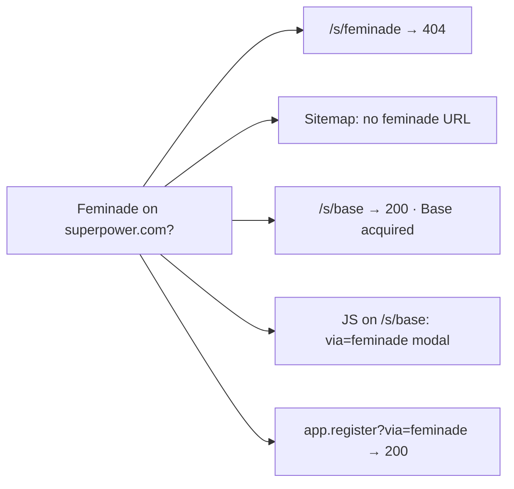
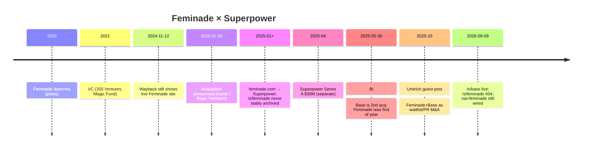

# Feminade — acquisition / relationship to Superpower

**Compiled:** 2026-09-09 (Australia/Sydney)  
**Do not invent.** Claims tagged with source URL, **[X]**, **[off-site]**, or **[inferred]**.

---

## Snapshot

| Field | Detail | Source |
| --- | --- | --- |
| Target | **Feminade** (Feminade Inc.) — women’s hormone / functional health testing | Press + Roya LinkedIn |
| Acquirer | **Superpower** (Superpower Health) | Same |
| Announced | **2025-01-08** | Axios; Femtech Insider; Femtech World; Roya LinkedIn |
| Deal structure | Mix of **cash + equity**; terms **not disclosed** | Axios; Femtech Insider |
| Feminade founder | **Roya Pakzad** (Founder & CEO) | Same |
| Post-deal role (Roya) | Contract / transition support; **not** joining Superpower long-term | Femtech World |
| Official Superpower acquisition LP | **`/s/feminade` → 404** (confirmed 2026-09-09) | https://superpower.com/s/feminade |
| Contrast | **Base** has live acquisition landing `/s/base` | https://superpower.com/s/base |
| On-site residue | JS on Base landing: `.feminade-modal` + `via=feminade` query handling | `/s/base` HTML (curl 2026-09-09) |
| Confidence | **High (~90%)** deal occurred | Multi-source press + founder + domain redirect; gap = no Base-style LP |

---

## Inbound (on-site)



| Check | Result (2026-09-09) | Source |
| --- | --- | --- |
| `/s/feminade` | **HTTP 404** | https://superpower.com/s/feminade |
| Sitemap webflow | **No** `feminade` / no `/s/feminade` | https://superpower.com/sitemap-webflow.xml |
| `/s/base` | **200** — “Base has been acquired by Superpower…” | https://superpower.com/s/base |
| Homepage / blog origin | **No** Feminade mention | Homepage; https://superpower.com/blog/superpower-is-now-199 |
| `superpower.com/feminade` | **301 →** `/welcome?via=feminade` → welcome-v2 | Referral funnel, not acq LP |
| `feminade.com` | **301 →** Superpower `?via=feminade` | Brand domain under Superpower control |
| Related paths (`/partners/feminade`, `/join/feminade`) | **404** | — |
| Wayback `/s/feminade` | **No snapshots found** | Cannot confirm a former LP |
| Register deep link | `app.superpower.com/register?via=feminade` → **200** | Referral code still live |

Residual JS on `/s/base`:

```js
const modal = document.querySelector('.feminade-modal');
if (currentUrl.includes('via=feminade')) {
  modal.style.display = 'flex';
} else {
  modal.style.display = 'none';
}
```

`.feminade-modal` markup **not** found in Sep 2026 HTML pull (orphaned JS). Google snippets claiming acquisition copy on misc Superpower URLs appear **stale** vs live HTML.

**Read:** Feminade was wired as a **referral / migrate-members** path, not a published acquisition story page like Base.

---

## Outbound (press / founders / social)

| Date | Source | Claim |
| --- | --- | --- |
| **2025-01-08** | [Axios Pro](https://www.axios.com/pro/health-tech-deals/2025/01/08/wellness-startup-superpower-women-focused-feminade) | Exclusive: cash + equity; CEO **Roya Pakzad** told Axios |
| **2025-01-08** | [Roya LinkedIn](https://www.linkedin.com/posts/royapakzad_i-am-very-excited-to-share-that-feminade-activity-7282818998335897600-TPeA) | “Feminade Inc. has been acquired by Superpower…” |
| **2025-01-08** | [Femtech Insider](https://femtechinsider.com/preventative-health-platform-superpower-acquires-feminade-to-strengthen-womens-health-offering/) | Women’s health; Jacob Peters quote; ~$4M pre-seed narrative then |
| **~2025-01** | [Femtech World](https://www.femtechworld.co.uk/news/feminade-founder-announces-acquisition-by-ai-health-startup-superpower/) | Pakzad contract transition only; CMO Dr Erin Rhae Biller; Serena Williams angel |
| **2025-05-30** | [Business Insider](https://www.businessinsider.com/ai-startup-superpower-acquiring-base-food-as-medicine-2025-5) | Base = **second** 2025 acq; Feminade was first |
| **2025-10-12** | [Open Source CEO — Kevin Unkrich](https://www.opensourceceo.com/p/superpower-guest-post) | Unkrich names Feminade + Base as waitlist/PR M&A |
| Ongoing | LinkedIn Feminade / Roya | “Acquired by Superpower” / “Built & Exited Feminade” |

Jacob Peters (press often titled **CEO** at announcement time):

> “Healthcare today is fundamentally broken, especially for women. Feminade’s remarkable growth and deep expertise in women’s health make them the perfect partner…”

### What Feminade was (pre-deal)

| Aspect | Claim | Source |
| --- | --- | --- |
| Launch | Late **2020** (Miami) | Femtech Insider; Dealroom |
| Focus | Women’s hormone / functional testing; irregular cycles, mood, weight, perimenopause | Femtech World; Insider |
| Flagship | **Dried urine** hormone + metabolite tests | Same |
| Investors | 305 Ventures, Magic Fund (2021); angel incl. **Serena Williams** / Serena Ventures | Same |
| Wayback | Live hormone-concierge site still visible **2024-11-12** | web.archive.org |

### Kevin / X

- Unkrich guest post **explicitly claims** Feminade + Base acquisitions (Oct 2025).
- [@feminadeinc](https://x.com/feminadeinc): display name **“Feminade (acquired by Superpower)”**; link to Superpower `via=` referral.
- No Kevin / @superpower / Max / Jacob Feminade **acquisition status** found in public X slice — see [kevin-on-x.md](kevin-on-x.md).

---

## Base vs Feminade (official-site documentation)

| Dimension | Base | Feminade |
| --- | --- | --- |
| Dedicated `/s/{brand}` | **Yes** | **No** — **404** |
| Brand domain | Separate Base story on Superpower | **`feminade.com` → Superpower** |
| Referral param | `via=base` | `via=feminade` on register / welcome / Base JS |
| Press confirmation | Yes (e.g. BI May 2025) | Yes (Axios Jan 2025 + others) |

---

## Timeline



---

## Conflicts & how to cite

| Conflict | Detail |
| --- | --- |
| **Site vs press** | Press + Roya say acquired Jan 2025; no `/s/feminade` LP. Base is the opposite. |
| **Jacob title** | Jan 2025 press: Jacob **CEO**; Series A page: **Max = CEO**, Jacob = Executive Chairman. Cite by date. |
| **Funding era** | Femtech Insider ~$4M pre-seed at acq write-up; later Series A **$30M**. Do not mix eras. |

- **Safe:** *Press and Feminade’s founder announced Superpower’s acquisition of Feminade on 2025-01-08 (cash + equity, terms undisclosed). Live site documents Base at `/s/base` but returns 404 for `/s/feminade`; only referral plumbing (`via=feminade`) remains.*
- **Unsafe:** *“Official Superpower acquisition page for Feminade”* — does not exist as of 2026-09-09.
- **Unknown:** purchase price; legal-entity status; member data/product migration; whether `/s/feminade` ever shipped.

### Watch

| Signal | Action |
| --- | --- |
| `/s/feminade` leaves 404 | Update this file + inbound-tree |
| `via=feminade` / `.feminade-modal` removed | Note plumbing cleanup |
| On-site press/blog naming Feminade | Elevate from off-site-only |

---

## Screenshots


| Asset | Evidence |
| --- | --- |
| [feminadeinc-x-profile.png](assets/feminadeinc-x-profile.png) | **[X]** Handle **@feminadeinc**; display name **“Feminade (acquired by Superpower)”**; link to Superpower `via=` referral. Joined Nov 2019. |

### Related

- [kevin-on-x.md](kevin-on-x.md) — Kevin X scrape (Base announcement; Feminade account rename only)
- Web inbound tree: [`../web/inbound-tree.md`](../web/inbound-tree.md)
