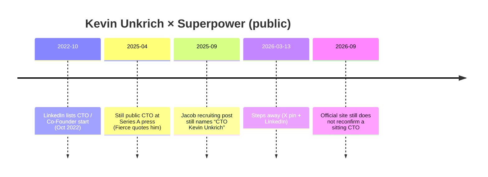

# Kevin Unkrich — stepping down as CTO

**Draft for company profile repo** · Compiled 2026-09-09 (Australia/Sydney)  
**Do not invent.** Every claim is tagged with a source URL, **[X]**, **[off-site]**, or **[inferred]**.

---

## Snapshot

| Field | Detail | Source |
| --- | --- | --- |
| Person | Kevin Unkrich | https://x.com/KevinUnkrich ; https://www.linkedin.com/in/unkrich5 |
| Handle | [@KevinUnkrich](https://x.com/KevinUnkrich) | **[X]** profile screenshot `/workspace/superpower-x/kevin-unkrich.png` |
| Prior role | Co-founder & CTO, Superpower Health | His own exit posts (X + LinkedIn); press (Fierce, TechCrunch, Forbes) |
| Exit date | **2026-03-13** (“today I’m sharing…”) | https://www.linkedin.com/posts/unkrich5_after-3-amazing-years-today-im-sharing-activity-7438290793817124864-RzgA |
| Tenure framing | “3+ amazing years” as co-founder/CTO | Same LinkedIn post; pinned X post (mirrored wording) |
| LinkedIn tenure span (stale?) | Lists Superpower CTO/Co-Founder **Oct 2022 – Present** even after exit post | https://www.linkedin.com/in/unkrich5 — **conflict** with exit narrative |
| Next step (stated) | Taking time to explore next professional adventure; updates via personal site | Exit posts; https://unkri.ch/about/ |
| Current official-site role | **Not listed** as sitting CTO; origin copy often says only “Kevin” | https://superpower.com/blog/superpower-is-now-199 ; https://superpower.com/series-a |

---

## What he said (primary)

### X — pinned post (~13 Mar)

Profile: San Francisco, CA · Joined Mar 2012 · bio at scrape: *(bio)hacker, minimalist | prev founded @superpower; @ycombinator s20 alum; aws engineer; 30u30*  
Source: **[X]** https://x.com/KevinUnkrich · local screenshot `/workspace/superpower-x/kevin-unkrich.png` · prior brief `/workspace/superpower-x/BRIEF.md`

Visible pinned opener (screenshot + prior scrape): *“After 3+ amazing years, today I'm sharing that I've decided to step away…”*  
Full text recovered from public mirrors of the same post (treat as **[off-site]** mirror of X, cross-check live):

> After 3+ amazing years, today I'm sharing that I've decided to step away from Superpower Health, the company I co-founded and served as CTO. I'm incredibly proud of everything the team has accomplished, grateful for their belief and support, and still believe in the power and importance of proactive, personalized, data-driven medicine made accessible to everyone. I'm certain the team will continue to push the mission forward and build the future of healthcare, and I'll be rooting them on the entire way. Next for me - I'll be taking some time to explore the next professional adventure to embark on. If you want to stay up to date with my journey, feel free to subscribe to updates at unkri.ch

- Mirror used when live X fetch was login-walled: https://zamantika.com/profile/KevinUnkrich **[off-site]**  
- **Unknown:** exact X status ID not captured in local `sources-x.md` (unlike OrganAge / Giannis IDs).

### LinkedIn — same day (2026-03-13)

https://www.linkedin.com/posts/unkrich5_after-3-amazing-years-today-im-sharing-activity-7438290793817124864-RzgA  

Same substance: stepped away from Superpower Health as co-founder/CTO after 3+ years; proud of team; believes in proactive/personalized/data-driven medicine; exploring next adventure; subscribe at https://unkri.ch.

### Personal site

https://unkri.ch/about/ — “Previously: Co-founder, CTO - Superpower Health”; also YC S20 co-founder/CEO; Amazon SWE; living in San Francisco. Homepage https://unkri.ch/ is invite/gated for deeper content.

---

## Timeline (scannable)

| Date | Event | Source |
| --- | --- | --- |
| Oct 2022 | LinkedIn: CTO, Co-Founder start at Superpower | https://www.linkedin.com/in/unkrich5 ; TheOrg https://theorg.com/org/superpower-2/org-chart/kevin-unkrich |
| Apr 2025 | Quoted as co-founder & CTO on AI (“trained on medical literature with proprietary biomarker data…”) | https://www.fiercehealthcare.com/health-tech/new-startup-superpower-scores-30m-launch-personalized-health-testing |
| ~2025-09-26 | Jacob Peters recruiting post still refers to “our CTO Kevin Unkrich” | LinkedIn activity cited on Kevin’s profile feed (Jacob post) |
| **2026-03-13** | Public step-away as co-founder/CTO | LinkedIn activity above; **[X]** pin |
| 2026-09-09 | Site: Max = CEO, Jacob = Executive Chairman; Kevin first-name-only in origin blog | https://superpower.com/series-a ; https://superpower.com/blog/superpower-is-now-199 |

---

## Conflicts & diligence notes

| Issue | Notes |
| --- | --- |
| Sitting CTO? | **Do not** describe Kevin as current CTO unless Superpower reconfirms. His own posts + X bio (“prev founded”) say otherwise. |
| LinkedIn “Present” | Profile still shows Superpower as current in some scrapes after the exit post — treat as **stale directory data**, not a rehire claim. |
| Title history on site | Official marketing often says only “Kevin”; full name + CTO stronger on X/press than homepage. |
| Successor CTO | **Unknown** — no primary announcement found naming a replacement CTO as of 2026-09-09. |
| Equity / board / advisor status post-exit | **Unknown** — exit posts do not say. |
| Exact X status ID | **Gap** — not stored in local X sources pack. |

---

## How to cite in the company profile

- Safe: *Co-founder; former CTO; stepped away 2026-03-13 after 3+ years (his own X/LinkedIn).*  
- Unsafe: *Current CTO of Superpower* (contradicted by primary self-statements).

### Related drafts
- [kevin-biohacking.md](kevin-biohacking.md) — bio / founding wound / self-ID as (bio)hacker  
- [feminade.md](feminade.md) — acquisition (separate topic; Kevin not a primary Feminade source)

