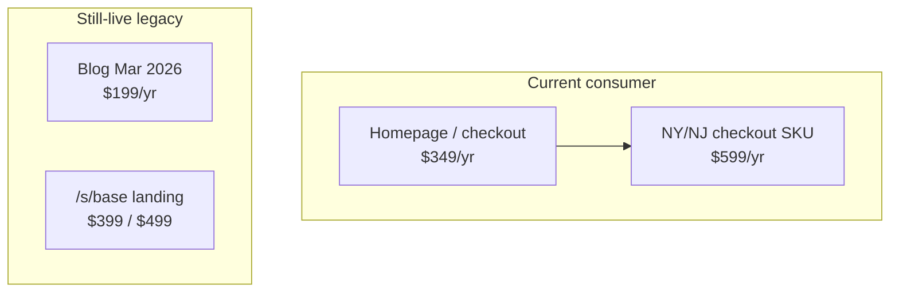
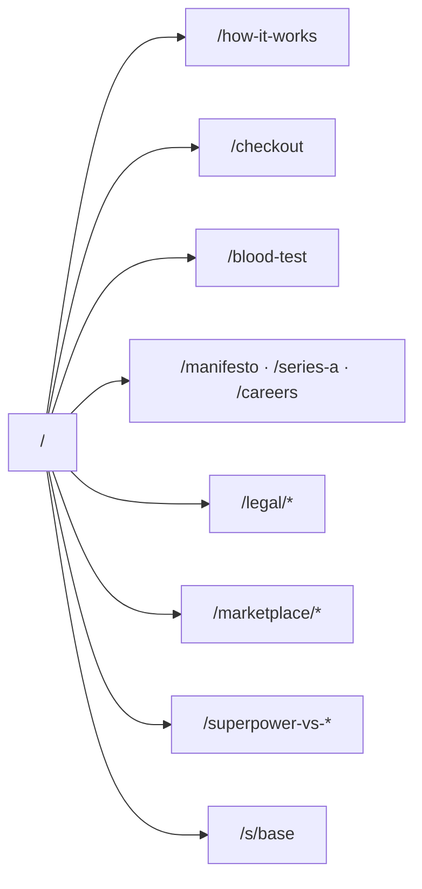

# Superpower Health — Web & outbound sources

**Compiled:** 2026-09-09 (Australia/Sydney)  
**Primary:** [superpower.com](https://superpower.com/)  
**Entity:** Superpower Health, Inc.  
**Method:** Official pages + first-hop outbound links. Checkout prices from embedded catalog JSON.

---

## Snapshot

| Field | Value |
| --- | --- |
| Brand | Superpower |
| What it is | Preventive health membership (labs → dashboard → protocol → care team / marketplace) |
| Legal stance | Facilitates labs/clinicians/pharmacies — **not** itself a healthcare provider |
| Addresses | Privacy: 11209 National Blvd #1016, LA 90064 · Careers: 140 New Montgomery St, SF |
| Funding | **$30M Series A** — Forerunner-led ([/series-a](https://superpower.com/series-a)) |
| Trust / scale | Trustpilot **4.6** · “64,000+ members” (some pages) · “150,000+” waitlist CTAs |

---

## Leadership (on-site)

| Name | Role |
| --- | --- |
| Max Marchione | CEO / founder |
| Jacob Peters | Executive Chairman |
| Kevin | Co-founder (first name only on site) |
| Dr. Anant Vinjamoori, MD | Chief Longevity Officer |

Featured clinicians (marketing): Connealy, Tatem, Lufkin, Malkin, Amy Shah, Molly Maloof, Derick En’Wezoh.

---

## Pricing (live conflicts)

| Source | Price | Biomarkers / draws |
| --- | --- | --- |
| Homepage + checkout `baseline-membership-sep-2026` | **$349/yr** | 150+ · **2 draws** |
| Checkout NY/NJ SKU | **$599/yr** | (state variant; BioRef naming) |
| [Blog $199](https://superpower.com/blog/superpower-is-now-199) | $199/yr | 100+ · 1 draw framing |
| [/s/base](https://superpower.com/s/base) | $399 / $499 | 100+ · older “24 states” copy |

**Also:** CTA day-rates ($0.82 vs $0.96/day) · Advanced panel add-ons Quest **$388** / BioRef **$598**.

Membership Agreement effective **9.01.2026** — annual auto-renew; satisfaction refund window (7 days after results or 45 days after start).

---

## What’s included (current marketing)

- 150+ biomarkers · two blood draws/year
- Data Vault dashboard · wearable sync (Apple Health, Whoop, Oura…)
- Personalized protocol · Superpower AI chat
- Care team (non-clinical) + affiliated Medical Groups for clinical care
- Marketplace: Galleri, gut/toxins, supplements, peptides, Rx pathways
- HSA/FSA eligible · **does not bill insurance**

---

## Labs & geography

| Partner | Evidence |
| --- | --- |
| **Quest** | Primary · “2,000+” locations (some copy says 3,000+) |
| **LabCorp** | Named in Membership Agreement §7 |
| **BioRef** | NY/NJ / alternate checkout SKUs |

At-home phlebotomy: extra fee (older pages +$99 / ~$119).  
Availability: **37+ US states**; homepage vs how-it-works state lists **differ**; NY/NJ called out for different fees.

---

## Acquisitions & partners

| Item | On-site status |
| --- | --- |
| **Base** | Confirmed — [/s/base](https://superpower.com/s/base) |
| **Feminade** | `/s/feminade` **404** · only `via=feminade` JS |
| SoulCycle | Press outbound (Athletech) |
| B2B | [/organizations](https://superpower.com/organizations) + Typeform |
| Affiliates | [partners.dub.co/superpower](https://partners.dub.co/superpower) |
| LegitScript | Footer certified |

---

## Site map (core paths)

Legal dates: privacy **8.18.2026** · terms **8.25.2026** · membership **9.01.2026**.  
Sitemaps: webflow · marketplace · locations · guides · biomarker-testing-companies (~7.4k URLs per inbound scrape).

---

## Outbound hyperlink tree (first-hop)

```mermaid
flowchart TB
  Site[superpower.com] --> Social[Social & reviews]
  Site --> Ops[Careers / forms / app]
  Site --> Press[Press]
  Site --> Compliance[Compliance]
  Social --> X["x.com/superpower"]
  Social --> IG[instagram.com/superpower]
  Social --> LI[linkedin.com/company/superpower]
  Social --> TP[trustpilot.com/review/superpower.com]
  Ops --> App[app.superpower.com]
  Ops --> Ashby[jobs.ashbyhq.com/superpower]
  Ops --> Notion[superpowerhealth.notion.site/culture]
  Ops --> Typeform[superpower-health.typeform.com/*]
  Ops --> Dub[partners.dub.co/superpower]
  Press --> Forbes[Forbes Series A]
  Press --> Athletech[Athletech SoulCycle]
  Compliance --> LS[legitscript.com]
  Compliance --> CMS[openpaymentsdata.cms.gov]
  Compliance --> FSMB[fsmb.org medical boards]
```

**Also outbound:** healthiesthoodie.com · founderhealth.com · jointrybe.com invite · Intellimize / Klaviyo / Meta / GA / TikTok (privacy + tags) · investor & celeb profile links on manifesto/Series A.  
**Not found:** App Store / Play Store hrefs · Stripe/PayPal checkout links (FLEX HSA rail in catalog JSON only).

---

## Contact

`hello@` · `concierge@` · `members@` · `member.compliance@` · `careers@` **superpower.com**

---

## Must-flag discrepancies

1. **$349 vs $199 vs $399/$499 vs $599 (NY/NJ)**
2. **150+ / 2 draws** vs older **100+ / 1 draw**
3. Quest **2,000+** vs **3,000+**
4. State lists differ homepage vs how-it-works
5. **64k members** vs **150k** waitlist CTAs
6. Marketing “HIPAA-compliant” vs Privacy: Superpower **may not** be a covered entity

---

## Related

- Inbound hyperlink tree → [`inbound-tree.md`](./inbound-tree.md)
- Long-form brief → [`company-brief.md`](./company-brief.md)
- Official Series A page notes → [`series-a.md`](./series-a.md)
- Short inbound notes → [`inbound-notes.md`](./inbound-notes.md)

---

*Quiet weekday scrape 8:00am Sydney — ping only on material change.*
