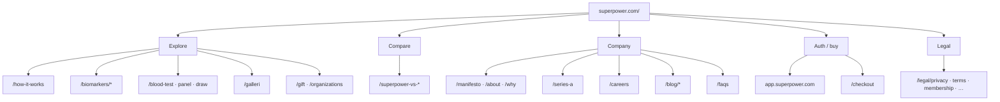
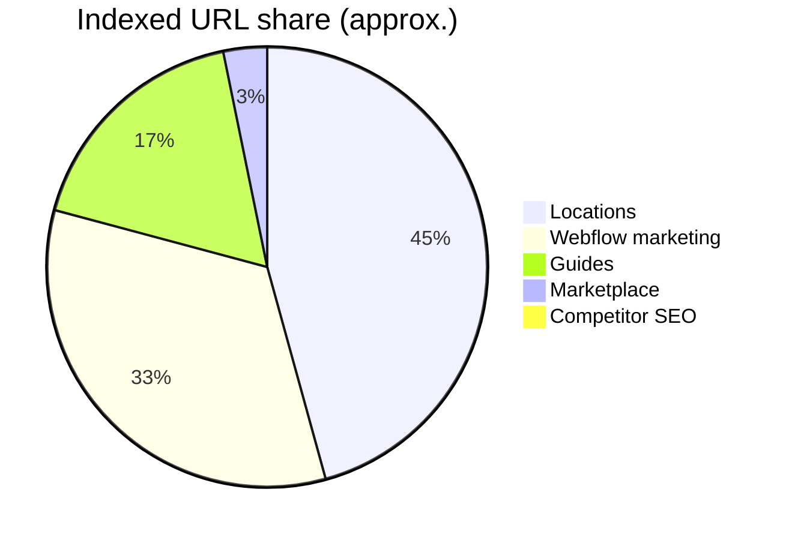

# Superpower Health — Inbound hyperlink tree

**Compiled:** 2026-09-09 (Australia/Sydney)  
**Primary:** [superpower.com](https://superpower.com/)  
**Lane:** Official-site nav + sitemap structure  
**Method:** Homepage href crawl + `/sitemap.xml` children. Quiet weekday scrape 8:00am Sydney.

---

## How the site is organized

---

## Primary nav clusters

| Cluster | Key paths | Notes |
| --- | --- | --- |
| Explore | `/how-it-works`, `/biomarkers`, `/blood-test`, `/blood-panel`, `/blood-work`, `/blood-draw`, `/at-home-blood-test`, `/biological-age`, `/galleri`, `/concierge`, `/gift`, `/organizations`, `/reviews` | Product + SEO aliases |
| Compare | `/superpower-vs-function-health`, `/superpower-vs-mito-health`, `/superpower-vs-insidetracker` | Named competitors |
| Company | `/manifesto`, `/about`, `/why`, `/series-a`, `/careers`, `/blog`, `/faqs`, `/baseline-membership` | About + trust |
| Auth / buy | `app.superpower.com`, `/checkout`, `/register`, `partners.dub.co/superpower` | App + affiliate |
| Legal | `/legal/privacy`, `/legal/terms`, `/legal/membership`, `/legal/dispute-resolution`, `/legal/medical-consent` | Updated Aug–Sep 2026 |

---

## Sitemap surface (~7.4k URLs)

| Sub-sitemap | ~URLs | Content |
| --- | ---: | --- |
| [`sitemap-webflow.xml`](https://superpower.com/sitemap-webflow.xml) | 2,481 | Marketing, blog, biomarkers, calculators, LPs |
| [`marketplace/sitemap.xml`](https://superpower.com/marketplace/sitemap.xml) | 238 | Marketplace SKUs |
| [`locations/sitemap.xml`](https://superpower.com/locations/sitemap.xml) | 3,391 | Lab locations |
| [`guides/sitemap.xml`](https://superpower.com/guides/sitemap.xml) | 1,307 | Health guides |
| [`biomarker-testing-companies/sitemap.xml`](https://superpower.com/biomarker-testing-companies/sitemap.xml) | 67 | Competitor / category SEO |
| **Total** | **~7,484** | Via [`/sitemap.xml`](https://superpower.com/sitemap.xml) |

---

## Content clusters

| Cluster | Pattern | Why it matters |
| --- | --- | --- |
| Biomarker encyclopedia | `/biomarkers/{slug}` | Largest clinical SEO surface |
| Best-biomarkers | `/best-biomarkers*` | Goal-based guides |
| Blog | `/blog/*` | Clinical, lifestyle, member stories, updates |
| Guides | guides sitemap | Aging, metabolic, hormones, toxins, cancer… |
| Calculators | `/calculator/*` | A1c↔eAG, eGFR, water intake… |
| Doctor / influencer LPs | `/dr-*`, `/giannis` | Campaign landings |
| Partner / B2B | `/forerunner`, `/organizations`, `/corporate-gifting` | Investor + employer |
| Acquisitions | `/s/base` live · `/s/feminade` **404** | Base yes; Feminade no |

---

## Watch list

| Signal | Why |
| --- | --- |
| New `/superpower-vs-*` | Competitor framing |
| New `/s/*` landings | M&A narrative |
| Sitemap URL count deltas | Content / SEO expansion |
| Legal path date bumps | Policy changes |
| Homepage / checkout price copy | Live vs legacy conflict |

---

## Related

- Web facts + outbound → [`README.md`](./README.md)
- Long-form brief → [`company-brief.md`](./company-brief.md)

---

*Quiet weekday scrape 8:00am Sydney — ping only on material change.*
